# Aegis — Software-Only MVP for HackPrinceton 2026

## Problem Frame

56 million Americans 65+ want to age at home. Their adult children have no unified way to monitor groceries, medication adherence, or physical safety — and no system that takes action on their behalf. Existing solutions are fragmented (Life Alert, paper pill boxes, family group chats) and passive.

Aegis is a software-only caregiver system built around **three live video feeds** and **three dedicated iMessage chats**, powered by an AI agent swarm on OpenClaw. Each feed monitors a specific domain; each chat delivers alerts and enables family interaction for that domain.

## User Flow

```mermaid
flowchart TB
    CAM1[Grocery Shelf Camera] -->|periodic snapshots| VA1[Vision: detect low supply]
    CAM2[Medicine Table Camera] -->|periodic snapshots| VA2[Vision: detect missed meds]
    CAM3[Living Area Camera] -->|frequent snapshots| VA3[Vision: detect fall / fire / smoke]

    VA1 -->|trigger| FLOW1
    VA2 -->|trigger| FLOW2
    VA3 -->|trigger| FLOW3

    subgraph FLOW1 [F1: Groceries]
        TL1[TransactionLink: pull past orders] --> COMPARE[Compare shelf vs order history]
        COMPARE --> SHOP[Shopping API: filter orderable items]
        SHOP --> SPLIT[Split: orderable vs manual-buy]
        SPLIT --> IMSG1[iMessage Groceries Chat: send list]
        IMSG1 --> EDIT[Family replies natural language edits]
        EDIT --> APPROVE[Family approves]
        APPROVE --> CHECKOUT[Knot Checkout: place order]
    end

    subgraph FLOW2 [F2: Medical]
        SCHED[Prescription schedule] --> VOICE[Voice reminder via phone speaker]
        VOICE --> WAIT[Wait for elder to take meds]
        WAIT -->|not taken| IMSG2[iMessage Medical Chat: immediate alert]
    end

    subgraph FLOW3 [F3: Physical Emergency]
        DETECT[Emergency detected] --> IMSG3[iMessage Emergency Chat: immediate alert]
    end

    DAILY[End of day] --> SUMMARY[Daily summary to general family chat]
```

## Requirements

**Video Feed Infrastructure**
- R1. Three video feeds from phone cameras or webcams, each pointed at a designated area: grocery shelf, medicine table, living area
- R2. The agent analyzes periodic snapshots (not continuous video streams) via a vision model
- R3. Snapshot frequency is per-domain: every ~10 minutes for groceries, every ~1 minute around scheduled med times, every ~30 seconds for emergency monitoring

**F1: Groceries (iMessage dedicated chat)**
- R4. When the vision model detects the grocery shelf is significantly emptier than normal, the grocery flow triggers
- R5. The agent pulls past order history from Knot TransactionLink (SKU-level: exact items, brands, quantities)
- R6. The agent compares what the camera sees on the shelf against what was in past orders to produce a delta of likely-needed items
- R7. The agent checks each item against Knot Shopping API to determine what is actually orderable (Walmart, Target, Costco, DoorDash, Amazon)
- R8. The family receives a filtered list in the dedicated Groceries iMessage chat, split into: orderable items and items that need manual purchase
- R9. The family can reply in natural language to add, remove, or modify items (e.g. "Remove milk, add orange juice")
- R10. The agent parses the edits, updates the cart, and confirms the updated list
- R11. On family approval, the agent places the order via Knot Shopping `Sync Cart` → `Checkout`
- R12. Order confirmation is sent back to the same Groceries chat

**F2: Medical (iMessage dedicated chat)**
- R13. At prescription-scheduled times, the phone at the medicine table plays a voice reminder through its speaker telling the elder which specific medicine to take
- R14. The vision model watches the medicine table for changes (pill removal, bottle movement) to determine if the elder took the medication
- R15. If the vision model does not detect medicine being taken within a configurable window after the voice reminder, an immediate alert is sent to the dedicated Medical iMessage chat
- R16. The agent maintains conversational memory of health interactions (e.g. "Yesterday you mentioned your knee was hurting — how is it today?")

**F3: Physical Emergency (iMessage dedicated chat)**
- R17. The living area camera runs at the highest snapshot frequency (~30 seconds)
- R18. The vision model detects: person fallen, fire/smoke, prolonged inactivity (no motion for extended period)
- R19. On detection, an immediate alert is sent to the dedicated Physical Emergency iMessage chat with what was detected, timestamp, and severity
- R20. No batching, no delay — fires the moment the event is confirmed

**Daily Summary**
- R21. Once per day (evening), a summary message is sent to a general family chat covering all three domains
- R22. The summary is generated by an LLM call over the day's event log, formatted as a single readable message

**Conversational Memory (cross-cutting)**
- R23. The agent remembers past conversations and health mentions across days, referencing them in future check-ins
- R24. Memory is the backbone infrastructure for all three features, not a standalone feature

**iMessage Integration**
- R25. Three dedicated iMessage chats via Photon `imessage-kit`, one per domain (Groceries, Medical, Emergency)
- R26. Each chat operates independently — alerts in one chat do not affect the others
- R27. The agent watches for replies in each chat via `sdk.startWatching()` and responds contextually
- R28. Photon's `MessageScheduler` handles the daily summary timing

## Success Criteria

- The grocery flow works end-to-end in the demo: camera detects low supply → TransactionLink comparison → filtered list → family edits via iMessage reply → Knot Checkout places order
- A missed medication triggers an immediate iMessage alert within 2 minutes of the reminder window closing
- A simulated fall triggers an immediate emergency iMessage alert
- The daily summary accurately reflects the day's events across all three domains
- Judges can see all three video feeds and the corresponding iMessage chats during the demo

## Scope Boundaries

- **No hardware** — all sensing is via phone cameras / webcams, no Arduino, no Raspberry Pi, no custom sensors
- **No elder-facing app** — the elder interacts with voice reminders from the phone speaker and the camera passively watches; no app installation required for the elder
- **No real medication purchases** — the system reminds and monitors but does not order controlled substances
- **Side features (post-MVP only):** Bill Protector (Knot SubManager), Health Agent drug-interaction flagging (K2 Think V2)
- **No continuous video streaming** — periodic snapshots only, analyzed by a cloud vision model

## Key Decisions

- **Video feeds over hardware sensors:** Cameras (phones/webcams) replace all Arduino/Pi sensor hardware. The team has no hardware experience and this is a 24-hour hackathon.
- **Three dedicated iMessage chats:** Separating domains into distinct chats prevents alert fatigue and lets family members mute non-urgent channels.
- **TransactionLink for grocery specificity:** The camera triggers the flow (detects low supply), but TransactionLink provides the actual item list based on purchase history. Smarter than pure vision.
- **Natural language cart editing:** Family replies in plain English to modify the grocery list rather than using a separate UI. Keeps everything in iMessage.
- **Phone speaker for medication reminders:** The phone at the medicine table doubles as camera + speaker. One device, two jobs.
- **Snapshot-based vision, not streaming:** Periodic frame analysis via vision API is 1% of the complexity of real-time video for 95% of the value.

## Dependencies / Assumptions

- Knot API access (TransactionLink + Shopping) available at the hackathon sponsor table
- Photon `imessage-kit` runs on a macOS machine (team has at least one Mac for the demo)
- At least three phones or webcams available for the demo setup
- Vision model API access (GPT-4o, Claude vision, or similar) for snapshot analysis
- OpenClaw provides the agent runtime, heartbeat, memory, and subagent spawning

## Outstanding Questions

### Deferred to Planning

- [Affects R2][Technical] Which vision model to use for snapshot analysis (GPT-4o vs Claude vision vs other) — evaluate cost, speed, and accuracy during implementation
- [Affects R13][Technical] How to implement TTS on the medicine-table phone — browser-based Web Speech API, ElevenLabs via OpenClaw, or pre-recorded audio files
- [Affects R1][Technical] Phone camera app or browser `getUserMedia` for the video feeds — decide based on demo setup constraints
- [Affects R6][Needs research] How accurate is vision-based shelf comparison in practice — may need a "baseline full shelf" reference photo for comparison
- [Affects R7][Needs research] Which merchants are actually available via Knot Shopping in development mode — call `List Merchants` with `type=shopping` early

## Next Steps

→ `/ce:plan` for structured implementation planning
