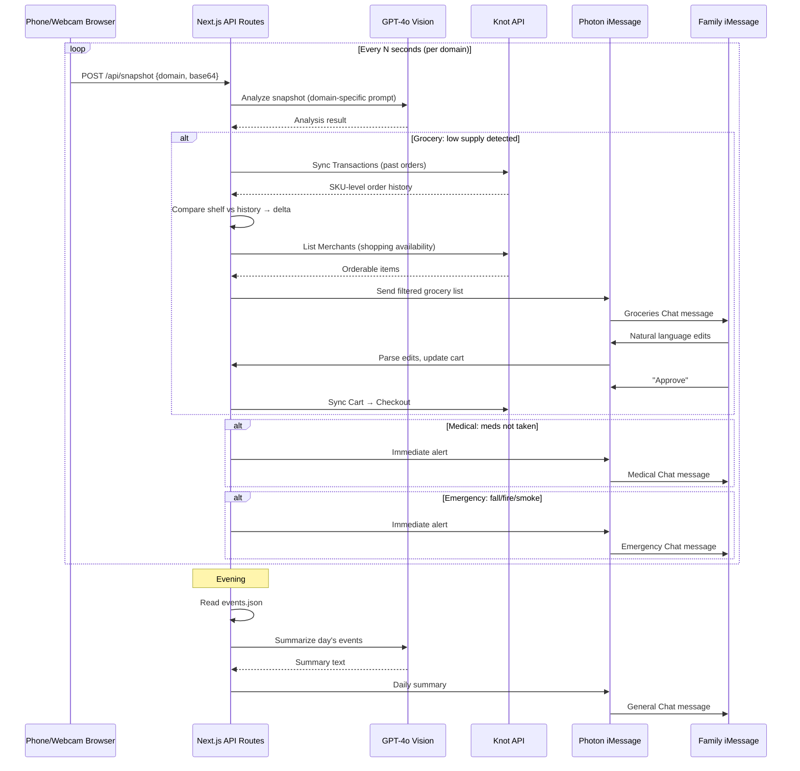

---

## title: "feat: Build Aegis MVP — Video-Powered Elder Care Agent System"
type: feat
status: active
date: 2026-04-18
origin: docs/brainstorms/2026-04-18-aegis-mvp-requirements.md

# feat: Build Aegis MVP — Video-Powered Elder Care Agent System

## Overview

Build a software-only elder care system for HackPrinceton 2026 (24-hour hackathon). Three phone/webcam video feeds monitor groceries, medication, and physical safety. Three dedicated iMessage chats deliver alerts and enable family interaction. The grocery flow uses Knot APIs to auto-reorder. A daily summary consolidates everything.

## Problem Frame

Adult children of aging parents have no unified system that monitors groceries, medication adherence, and physical safety — and actually takes action. Aegis solves this with video feeds as the universal sensor layer and iMessage as the family interface, backed by AI vision analysis and Knot APIs for real commerce actions. (see origin: `docs/brainstorms/2026-04-18-aegis-mvp-requirements.md`)

## Requirements Trace

- R1–R3. Three video feeds, periodic snapshots via vision model, per-domain frequency
- R4–R12. Grocery flow: vision trigger → TransactionLink history → Shopping API availability → family iMessage edits → Checkout
- R13–R16. Medical flow: TTS voice reminders → vision monitors med-taking → iMessage alert on miss → conversational memory
- R17–R20. Emergency flow: high-frequency vision → fall/fire/smoke detection → immediate iMessage alert
- R21–R22. Daily summary via scheduled LLM call
- R23–R24. Conversational memory as cross-cutting infrastructure
- R25–R28. Three dedicated iMessage chats via Photon, independent operation, reply watching

## Scope Boundaries

- No hardware sensors — phone cameras and webcams only
- No elder-facing app — elder hears voice reminders from the phone speaker, camera watches passively
- No real medication purchases
- No continuous video streaming — periodic snapshots only
- Post-MVP only: Bill Protector, drug-interaction flagging

## Key Technical Decisions

- **Next.js full-stack app**: Single codebase for dashboard UI + API routes. Fastest path for a hackathon — one `npm run dev`, one deploy. Server-side API routes handle vision analysis, Knot calls, and scheduling.
- **GPT-4o for vision analysis**: Best balance of vision quality, speed, and availability. Send base64 snapshots to the Chat Completions API with domain-specific prompts.
- **Browser `getUserMedia` for camera feeds**: Phones and webcams connect via the web app in a browser. No native app needed. Judges see feeds live on the dashboard.
- **Browser Web Speech API for TTS**: `speechSynthesis` on the medicine-table phone's browser tab. Zero setup, no API key, works offline.
- **Photon `imessage-kit` for iMessage**: Runs on the team's Mac. Three chat IDs, one SDK instance. Qualifies for the Photon hackathon track.
- **Baseline shelf photo for grocery comparison**: A reference "full shelf" photo is taken at setup time. Vision prompts include both baseline and current snapshot to detect depletion.
- **Simple JSON event log**: Append-only JSON file on disk. Good enough for a 24-hour demo. The daily summary LLM call reads this file.
- `**setInterval` scheduling**: No cron library needed. Configurable intervals per domain, running in the Node.js process.

## Open Questions

### Resolved During Planning

- **Vision model choice**: GPT-4o — fast, high quality, well-documented vision API
- **TTS mechanism**: Browser Web Speech API — zero dependencies, instant
- **Camera source**: Browser `getUserMedia` — works with phones and webcams, no app install
- **Shelf comparison approach**: Baseline reference photo + current snapshot sent together to GPT-4o
- **Build order**: F3 (Emergency) first — simplest end-to-end pipeline, proves the architecture. Then F2 (Medical). Then F1 (Grocery) — most complex, needs Knot APIs working.

### Deferred to Implementation

- Exact Knot merchants available in dev mode — call `List Merchants` with `type=shopping` as first task
- GPT-4o prompt tuning for each domain — iterate during implementation based on test snapshots
- How to handle `getUserMedia` permissions on phones that auto-sleep — may need a keep-alive ping

## Output Structure

```
aegis/
├── package.json
├── .env.example
├── next.config.ts
├── tsconfig.json
├── src/
│   ├── app/
│   │   ├── layout.tsx
│   │   ├── page.tsx                          # Dashboard: camera feeds + event log
│   │   ├── camera/
│   │   │   └── [domain]/page.tsx             # Camera page (opened on phone/webcam device)
│   │   └── api/
│   │       ├── snapshot/route.ts             # Receives base64 snapshots from cameras
│   │       ├── vision/route.ts               # Runs GPT-4o vision analysis
│   │       ├── grocery/
│   │       │   ├── check/route.ts            # Grocery vision trigger
│   │       │   ├── cart/route.ts             # Cart editing
│   │       │   └── checkout/route.ts         # Knot Checkout
│   │       ├── medical/
│   │       │   └── check/route.ts            # Medication monitoring trigger
│   │       └── emergency/
│   │           └── check/route.ts            # Emergency detection trigger
│   ├── lib/
│   │   ├── vision.ts                         # GPT-4o vision API wrapper
│   │   ├── knot.ts                           # Knot API client (TransactionLink + Shopping)
│   │   ├── imessage.ts                       # Photon SDK wrapper (3 chats)
│   │   ├── events.ts                         # Event log (append + read)
│   │   ├── scheduler.ts                      # setInterval-based task scheduler
│   │   └── prompts.ts                        # Vision prompts per domain
│   └── components/
│       ├── CameraFeed.tsx                    # getUserMedia + snapshot capture
│       ├── EventLog.tsx                      # Live event stream display
│       └── StatusCards.tsx                    # Domain status overview
└── data/
    ├── events.json                           # Append-only event log
    ├── baseline-grocery.jpg                  # Reference shelf photo
    └── prescriptions.json                    # Medication schedule config
```

## High-Level Technical Design

> *This illustrates the intended approach and is directional guidance for review, not implementation specification.*




## Implementation Units

### Phase 1: Foundation (Hours 0–6)

- **Unit 1: Project Scaffolding**

**Goal:** Set up the Next.js project with all dependencies and configuration.

**Requirements:** Foundation for all R-numbers

**Dependencies:** None

**Files:**

- Create: `package.json`
- Create: `next.config.ts`
- Create: `tsconfig.json`
- Create: `.env.example`
- Create: `src/app/layout.tsx`
- Create: `src/app/page.tsx` (placeholder)

**Approach:**

- `npx create-next-app@latest aegis --typescript --app --tailwind`
- Install: `@photon-ai/imessage-kit`, `openai` (for GPT-4o), `better-sqlite3` (Photon dep on Node)
- `.env.example` with: `OPENAI_API_KEY`, `KNOT_CLIENT_ID`, `KNOT_SECRET`, `KNOT_BASE_URL`
- Configure `data/prescriptions.json` with a sample medication schedule for the demo

**Test expectation:** none — pure scaffolding

**Verification:** `npm run dev` starts without errors, dashboard page loads at localhost:3000

---

- **Unit 2: Camera Feed Capture**

**Goal:** Build the camera page that phones/webcams open in a browser, captures periodic snapshots, and sends them to the server.

**Requirements:** R1, R2, R3

**Dependencies:** Unit 1

**Files:**

- Create: `src/app/camera/[domain]/page.tsx`
- Create: `src/components/CameraFeed.tsx`
- Create: `src/app/api/snapshot/route.ts`

**Approach:**

- The camera page uses `getUserMedia` to access the device camera and renders a live `<video>` preview
- A `<canvas>` element captures frames at the domain-specific interval (grocery: 10min, medical: 1min, emergency: 30s)
- Each frame is converted to base64 JPEG and POSTed to `/api/snapshot` with `{domain, image, timestamp}`
- The API route stores the latest snapshot in memory (or writes to `data/`) and triggers the domain-specific analysis
- The domain is set by the URL: `/camera/grocery`, `/camera/medical`, `/camera/emergency`
- Display a simple status overlay on the camera page: domain name, last capture timestamp, connection status

**Test scenarios:**

- Happy path: Camera page loads, getUserMedia grants access, video preview renders, first snapshot sent within interval
- Edge case: getUserMedia permission denied — show clear error message with instructions
- Edge case: Network disconnection — buffer snapshots locally, retry when reconnected
- Happy path: Different domains use different capture intervals as configured

**Verification:** Opening `/camera/grocery` on a phone shows the camera feed and POSTs snapshots to the server at the expected interval

---

- **Unit 3: Vision Analysis Service**

**Goal:** Build the GPT-4o vision wrapper that analyzes snapshots with domain-specific prompts.

**Requirements:** R2, R4, R14, R18

**Dependencies:** Unit 1

**Files:**

- Create: `src/lib/vision.ts`
- Create: `src/lib/prompts.ts`

**Approach:**

- `vision.ts` wraps the OpenAI Chat Completions API with `model: "gpt-4o"` and image input
- `prompts.ts` contains three prompt templates:
  - **Grocery:** Receives baseline photo + current photo. Returns JSON: `{low_supply: boolean, visible_items: string[], confidence: number}`
  - **Medical:** Receives before/after snapshots around the medication table. Returns JSON: `{meds_taken: boolean, changes_detected: string[], confidence: number}`
  - **Emergency:** Receives single snapshot. Returns JSON: `{emergency: boolean, type: "fall"|"fire"|"smoke"|"inactivity"|"none", confidence: number, description: string}`
- All prompts request structured JSON output for reliable parsing
- Include a confidence threshold — only trigger flows above 0.7 to reduce false positives

**Test scenarios:**

- Happy path: Send a test image to each domain prompt, receive valid JSON response
- Edge case: GPT-4o returns malformed JSON — handle gracefully, log error, skip this cycle
- Edge case: API rate limit or timeout — retry once, then skip cycle
- Happy path: Low-confidence results (< 0.7) do not trigger any flow

**Verification:** Calling `analyzeSnapshot("grocery", base64Image, base64Baseline)` returns a structured result

---

- **Unit 4: iMessage Integration**

**Goal:** Set up Photon SDK with three dedicated chats and reply watching.

**Requirements:** R25, R26, R27

**Dependencies:** Unit 1

**Files:**

- Create: `src/lib/imessage.ts`

**Approach:**

- Initialize `IMessageSDK` once at server startup
- On first run, use `sdk.listChats()` to identify or create three group chats (or DMs) for Groceries, Medical, Emergency, and a fourth for daily summary
- Store chat IDs in `.env` or a config file after initial setup
- Export helper functions: `sendGroceryMessage(text)`, `sendMedicalAlert(text)`, `sendEmergencyAlert(text)`, `sendDailySummary(text)`
- Set up `sdk.startWatching()` with `onDirectMessage` and `onGroupMessage` handlers that route replies to the correct domain handler based on `chatId`
- For the grocery chat: incoming replies are passed to the natural language cart editor (Unit 7)

**Test scenarios:**

- Happy path: Send a test message to each of the three chats, verify delivery
- Happy path: Reply to the grocery chat, verify the watcher receives and routes to the grocery handler
- Edge case: iMessage SDK fails to connect — log error, continue without iMessage (graceful degradation)
- Integration: Messages sent to one chat do not appear in or trigger handlers for other chats

**Verification:** Running the setup script sends a test message to all three chats and logs incoming replies

---

- **Unit 5: Event Logging System**

**Goal:** Build a simple append-only event log that all features write to and the daily summary reads from.

**Requirements:** R21, R22

**Dependencies:** Unit 1

**Files:**

- Create: `src/lib/events.ts`
- Create: `data/events.json`

**Approach:**

- `logEvent({domain, type, message, timestamp, metadata})` appends a JSON line to `data/events.json`
- `getEventsForDate(date)` reads and filters events for the daily summary
- Event types: `grocery_low_detected`, `grocery_order_sent`, `grocery_order_approved`, `grocery_order_placed`, `med_reminder_played`, `med_taken`, `med_missed`, `emergency_detected`, `emergency_alert_sent`
- Each event includes enough context for the daily summary LLM to produce a useful narrative

**Test expectation:** none — simple utility, verified through integration with other units

**Verification:** After logging a few test events, `getEventsForDate(today)` returns them correctly

---

### Phase 2: Core Features (Hours 6–16)

- **Unit 6: F3 — Emergency Detection Flow**

**Goal:** Wire the emergency camera → vision analysis → immediate iMessage alert pipeline. Built first because it's the simplest end-to-end flow and proves the entire architecture.

**Requirements:** R17, R18, R19, R20

**Dependencies:** Units 2, 3, 4, 5

**Files:**

- Create: `src/app/api/emergency/check/route.ts`

**Approach:**

- The `/api/snapshot` route, when receiving a `domain: "emergency"` snapshot, calls the vision service with the emergency prompt
- If `emergency: true` and `confidence > 0.7`, immediately call `sendEmergencyAlert()` with a formatted message including type, description, timestamp
- Log the event via `logEvent()`
- Duplicate suppression: don't re-alert for the same event type within 5 minutes (use in-memory timestamp tracking)
- The formatted alert message: `"⚠️ ALERT: {type} detected — {description}. [{timestamp}]"`

**Test scenarios:**

- Happy path: Submit a snapshot that triggers emergency detection → iMessage alert sent within seconds
- Happy path: Submit a normal snapshot → no alert sent
- Edge case: Same emergency type detected within 5 minutes → duplicate suppressed, no second alert
- Edge case: New emergency type detected within 5 minutes of a different type → alert sent (not suppressed)
- Error path: Vision API fails → log error, no alert sent (avoid false alarms)

**Verification:** Pointing the camera at a simulated fall scene sends an immediate iMessage to the Emergency chat

---

- **Unit 7: F2 — Medical Monitoring Flow**

**Goal:** Build the medication reminder (TTS) + vision monitoring + missed-med alert pipeline.

**Requirements:** R13, R14, R15, R16

**Dependencies:** Units 2, 3, 4, 5

**Files:**

- Create: `src/app/api/medical/check/route.ts`
- Create: `data/prescriptions.json`

**Approach:**

- `prescriptions.json` holds a simple schedule: `[{name: "Metformin", time: "08:00", window_minutes: 30}, ...]`
- The scheduler (Unit 5's interval) checks every minute if a medication time has arrived
- When a med time arrives:
  1. Send a message to the medicine-table phone's browser tab via a WebSocket or server-sent event: `"Time to take your Metformin"`
  2. The camera page on that phone uses `speechSynthesis.speak()` to play the reminder aloud
  3. Vision monitoring enters "active watch" mode — analyze snapshots every 30 seconds for the next `window_minutes`
  4. If vision detects changes on the medicine table (pill removal, bottle moved) within the window → log `med_taken`, no alert
  5. If the window expires without detection → log `med_missed`, send immediate alert to Medical iMessage chat
- The camera page needs a WebSocket connection to the server to receive TTS trigger events

**Test scenarios:**

- Happy path: Medication time arrives → phone speaks reminder → elder takes meds within window → no alert, `med_taken` logged
- Happy path: Medication time arrives → phone speaks reminder → elder does NOT take meds → alert sent to Medical chat after window expires
- Edge case: Multiple medications scheduled at the same time → both reminders play sequentially
- Edge case: Phone's browser tab is in background — `speechSynthesis` may be blocked; test and document fallback
- Integration: Medical alert appears only in Medical chat, not in Grocery or Emergency chats

**Verification:** Setting a prescription time to 2 minutes from now triggers the full flow: voice reminder → vision monitoring → alert on miss

---

- **Unit 8: F1 — Grocery Reorder Flow**

**Goal:** Build the full grocery pipeline: vision trigger → TransactionLink comparison → Shopping availability → family iMessage list → natural language editing → Knot Checkout.

**Requirements:** R4, R5, R6, R7, R8, R9, R10, R11, R12

**Dependencies:** Units 2, 3, 4, 5

**Files:**

- Create: `src/lib/knot.ts`
- Create: `src/app/api/grocery/check/route.ts`
- Create: `src/app/api/grocery/cart/route.ts`
- Create: `src/app/api/grocery/checkout/route.ts`
- Create: `data/baseline-grocery.jpg`

**Approach:**

- **Knot client (`knot.ts`):**
  - `listMerchants(type)` — call first thing to discover available merchants
  - `syncTransactions(merchantId, userId)` — pull past order history
  - `syncCart(merchantId, userId, products, deliveryLocation)` — add items to cart
  - `checkout(merchantId, userId)` — place the order
  - All calls use Basic Auth with `KNOT_CLIENT_ID:KNOT_SECRET`
  - Base URL toggles between `development.knotapi.com` and `api.knotapi.com`
- **Grocery check flow (`/api/grocery/check`):**
  1. Vision receives baseline shelf photo + current snapshot
  2. If `low_supply: true` → pull past transactions from TransactionLink
  3. Extract unique product list from past orders (item names, brands, quantities)
  4. Ask GPT-4o: "Given this shelf photo and this purchase history, which items are likely needed?" → structured list
  5. For each item, check Shopping API merchant availability
  6. Split into orderable vs. manual-buy
  7. Format and send to Groceries iMessage chat
- **Cart editing (`/api/grocery/cart`):**
  - The iMessage watcher detects replies in the Grocery chat
  - Send the reply text to GPT-4o with context: "Current cart is [items]. User says: '[reply]'. Return updated cart as JSON."
  - Send updated cart back to the chat for confirmation
  - On "approve" / "yes" / "looks good" → trigger checkout
- **Checkout (`/api/grocery/checkout`):**
  - Call Knot `Sync Cart` with the final item list
  - Call Knot `Checkout`
  - Send order confirmation to the Groceries chat
  - Log all events

**Test scenarios:**

- Happy path: Low supply detected → TransactionLink returns past orders → delta computed → orderable items sent to family → family approves → Knot Checkout succeeds → confirmation sent
- Happy path: Family replies "Remove milk, add orange juice" → cart updated → updated list sent for re-approval
- Happy path: Family replies "Approve" → checkout triggered
- Edge case: No past orders in TransactionLink (new user) → vision-only item identification, skip comparison
- Edge case: No items available via Shopping API → send manual-buy-only list with note "None of these can be auto-ordered"
- Error path: Knot API rate limit or auth failure → log error, notify family "Order could not be placed, please try manually"
- Integration: Grocery messages appear only in Grocery chat; replies from other chats are not processed as cart edits

**Verification:** The full flow works end-to-end in dev mode: shelf photo triggers list → family edits via iMessage → order placed via Knot → confirmation received

---

### Phase 3: Polish (Hours 16–22)

- **Unit 9: Daily Summary**

**Goal:** Generate and send an evening summary of all events across all three domains.

**Requirements:** R21, R22, R28

**Dependencies:** Units 5, 4

**Files:**

- Create: `src/lib/scheduler.ts` (if not already created as part of the interval system)

**Approach:**

- Scheduler triggers at a configured evening time (e.g. 8pm)
- Read today's events from `data/events.json`
- Send to GPT-4o with prompt: "Summarize these events for a family caregiver in one concise, warm paragraph. Cover medication, groceries, and safety."
- Send the result to the general (fourth) iMessage chat via `sendDailySummary()`
- Use Photon's `MessageScheduler` for the timing to satisfy the track requirement

**Test scenarios:**

- Happy path: Events logged throughout the day → summary accurately reflects all three domains
- Edge case: No events today → summary says "Quiet day — no alerts or activity detected"
- Edge case: Only one domain had events → summary covers just that domain without inventing data

**Verification:** After logging sample events, triggering the summary produces a readable, accurate message in the general chat

---

- **Unit 10: Dashboard UI**

**Goal:** Build the judge-facing dashboard showing live camera feeds and event stream.

**Requirements:** R1 (visual display), success criteria (judges can see feeds)

**Dependencies:** Units 2, 5

**Files:**

- Modify: `src/app/page.tsx`
- Create: `src/components/EventLog.tsx`
- Create: `src/components/StatusCards.tsx`

**Approach:**

- Three camera feed panels showing the latest snapshot from each domain (polled from server every few seconds, or via WebSocket/SSE push)
- Below the feeds: a live event log showing recent events in reverse chronological order, auto-updating
- Top row: three status cards (Groceries: OK/Low, Medical: OK/Missed, Emergency: OK/Alert) with color coding
- Keep it visually clean — dark theme, large text, readable from 6 feet away at a judging table
- Use Tailwind CSS for rapid styling

**Test scenarios:**

- Happy path: Dashboard shows three camera feeds updating in near-real-time
- Happy path: New event logged → appears in event log within 2 seconds
- Happy path: Status cards reflect current domain state accurately
- Edge case: One camera feed goes offline → status card shows "Disconnected" for that domain

**Verification:** Dashboard displays all three feeds, event log updates live, and status cards change when events fire

---

- **Unit 11: Demo Rehearsal & Hardening**

**Goal:** End-to-end rehearsal of the 2-minute demo script. Fix bugs, add fallbacks.

**Requirements:** All success criteria

**Dependencies:** All units

**Files:**

- Potentially any file for bug fixes

**Approach:**

- Run through the demo flow 3+ times:
  1. Show three camera feeds on dashboard
  2. Trigger emergency (simulate fall) → iMessage alert fires
  3. Trigger grocery low supply → list appears in Grocery chat → edit → approve → checkout
  4. Trigger medication miss → alert in Medical chat
  5. Show daily summary
- Add fallback for each demo step:
  - Pre-captured snapshots that can be submitted manually if live camera fails
  - Pre-formatted iMessage messages that can be sent manually if the pipeline stalls
  - Pre-computed Knot responses if API is down
- Test on the actual demo devices (phones, Mac, etc.)

**Test expectation:** none — manual testing and hardening

**Verification:** The full demo runs 3 times without failure

## System-Wide Impact

- **Interaction graph:** Camera pages → `/api/snapshot` → domain-specific check routes → vision service → iMessage. The iMessage watcher listens for replies and routes to grocery cart editor. Scheduler triggers TTS events via WebSocket and daily summary.
- **Error propagation:** Vision API failures should never send false alerts. All detection requires `confidence > 0.7`. API errors log and skip the cycle rather than crashing.
- **State lifecycle risks:** The grocery cart is ephemeral (held in memory during the editing session). If the server restarts mid-edit, the cart is lost — acceptable for a hackathon demo.
- **Unchanged invariants:** The elder never needs to install an app, create an account, or interact with a screen. The family only interacts via iMessage — no dashboard login required.

## Risks & Dependencies


| Risk                                                        | Mitigation                                                                                                              |
| ----------------------------------------------------------- | ----------------------------------------------------------------------------------------------------------------------- |
| Knot API access not available at hackathon                  | Visit sponsor table immediately. Have mock Knot responses ready as fallback.                                            |
| GPT-4o vision gives false positives for emergencies         | Set confidence threshold at 0.7. Have a "manual trigger" button on dashboard as backup.                                 |
| `getUserMedia` blocked on phone browsers                    | Test on actual phones early. Fallback: use IP Webcam app (Android) or continuity camera (Mac+iPhone).                   |
| `speechSynthesis` blocked when browser tab is in background | Keep medicine-table phone's browser tab in foreground. Set screen to never sleep.                                       |
| Photon iMessage requires macOS with Full Disk Access        | Confirm Mac is available and permissions are granted before hackathon starts.                                           |
| 24-hour time pressure                                       | Build F3 first (simplest), then F2, then F1. If F1 isn't done, demo F3+F2 and show Knot integration as a recorded clip. |


## Sources & References

- **Origin document:** [docs/brainstorms/2026-04-18-aegis-mvp-requirements.md](docs/brainstorms/2026-04-18-aegis-mvp-requirements.md)
- Photon iMessage SDK: [https://github.com/photon-hq/imessage-kit](https://github.com/photon-hq/imessage-kit)
- Knot Shopping API: [https://docs.knotapi.com/shopping/quickstart](https://docs.knotapi.com/shopping/quickstart)
- Knot TransactionLink: [https://docs.knotapi.com/transaction-link/use-cases](https://docs.knotapi.com/transaction-link/use-cases)
- OpenAI Vision API: [https://platform.openai.com/docs/guides/vision](https://platform.openai.com/docs/guides/vision)
- Web Speech API: [https://developer.mozilla.org/en-US/docs/Web/API/SpeechSynthesis](https://developer.mozilla.org/en-US/docs/Web/API/SpeechSynthesis)

