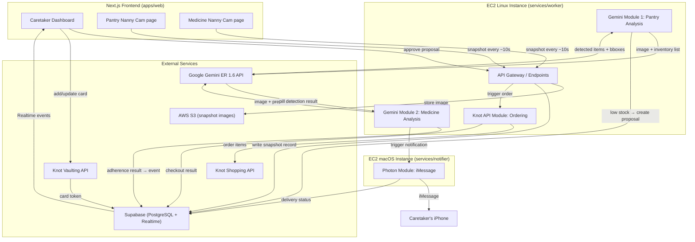

# Backend Implementation Plan: Gemini Analysis, Knot Ordering, Photon Messaging

## Overview

This plan covers the complete backend architecture and implementation for the Caretaker Command Center, grounded solely in `docs/product_idea.md`. The backend has five major systems:

1. **Next.js API layer** — serves the frontend, handles CRUD for profiles, inventory, prescriptions, cameras, proposals
2. **Gemini Module 1 (Pantry)** — receives pantry snapshots every ~10s, compares visible items against the inventory list from Supabase using Gemini ER Robotics 1.6, outputs a replenishment list when stock is low
3. **Gemini Module 2 (Medicine)** — receives medicine snapshots around scheduled pill times, compares visible pill state against the prescription from Supabase using Gemini ER 1.6, outputs yes/no/uncertain adherence result
4. **Knot API Module** — receives the replenishment list from Gemini Module 1, uses the patient's stored card (via Knot Vaulting) to place a grocery order on Walmart (via Knot Shopping)
5. **Photon iMessage Module** — receives the medication result from Gemini Module 2, sends an iMessage to the caretaker via Photon/spectrum-ts (requires macOS runtime)

Per product_idea.md: these modules run on AWS EC2. The two Gemini modules can share a single EC2 instance with parallel processing. The Knot module should be a separate process to avoid blocking Gemini work. The Photon module requires a macOS EC2 instance.

## Problem Frame

The product needs an always-on backend that ingests camera snapshots, runs AI vision analysis, and triggers downstream actions (grocery ordering, iMessage alerts) — all without the caretaker needing to manually intervene except for approving purchase proposals. The system processes two parallel data flows that share a Supabase data layer and a common event bus to the frontend dashboard.

## Requirements Trace (from product_idea.md)

- R1. Two parallel Gemini ER 1.6 modules: one for pantry, one for medicine
- R2. Pantry module: compare camera snapshots (every ~10s) against inventory list from Supabase
- R3. Pantry module: if items are low (e.g., 2 out of 10 visible = 20%), output replenishment list
- R4. Medicine module: compare camera snapshots against prescription from Supabase
- R5. Medicine module: check if right pill, right count, taken near scheduled time
- R6. Medicine output: yes (taken correctly with details) or no (alert with details)
- R7. Knot API module: take replenishment list + patient's card → order on Walmart
- R8. Knot API module: card details managed by caretaker per patient via Knot Vaulting SDK
- R9. Photon module: take medication result → send iMessage to caretaker's phone number
- R10. Photon requires macOS runtime (macOS EC2 instance on AWS)
- R11. Both modules' results appear on the caretaker dashboard
- R12. Dashboard updates are event-triggered (not polling) — "only updates when it actually has taken place"
- R13. Supabase for all persistent data: caretaker details, patient profile, inventory, prescriptions, camera state, proposals, events, notifications, checkout history
- R14. The two Gemini flows are parallel, not serial — both camera feeds hit the same EC2 instance independently

## Scope Boundaries

- No real authentication/authorization (light signup only)
- No multi-tenant architecture (one caretaker, one patient for hackathon)
- No production healthcare compliance
- No autonomous purchases without caretaker approval (human-in-the-loop gate)
- No RTSP/IP camera support in first build (browser camera via getUserMedia only)

---

## Supabase Schema Design

> *This illustrates the intended data model and is directional guidance for review, not implementation specification.*

```
┌─────────────────────────────────────────────────────────────────────┐
│                        SUPABASE TABLES                              │
├─────────────────────────────────────────────────────────────────────┤
│                                                                     │
│  caretakers                                                         │
│  ├── id (uuid, PK)                                                  │
│  ├── name (text)                                                    │
│  ├── phone (text) ── used by Photon for iMessage delivery          │
│  └── created_at (timestamptz)                                       │
│                                                                     │
│  patients                                                           │
│  ├── id (uuid, PK)                                                  │
│  ├── caretaker_id (uuid, FK → caretakers)                          │
│  ├── name (text)                                                    │
│  ├── relationship (text) ── "Grandmother", etc.                    │
│  └── created_at (timestamptz)                                       │
│                                                                     │
│  cameras                                                            │
│  ├── id (uuid, PK)                                                  │
│  ├── patient_id (uuid, FK → patients)                              │
│  ├── role (text) ── "pantry" or "medicine"                         │
│  ├── device_name (text)                                             │
│  ├── bind_token (text) ── for QR code binding                      │
│  ├── status (text) ── "offline", "online", "stale"                 │
│  ├── last_seen_at (timestamptz)                                     │
│  ├── last_snapshot_at (timestamptz)                                 │
│  └── created_at (timestamptz)                                       │
│                                                                     │
│  inventory_items                                                    │
│  ├── id (uuid, PK)                                                  │
│  ├── patient_id (uuid, FK → patients)                              │
│  ├── name (text) ── "Milk", "Bananas", etc.                       │
│  ├── target_quantity (int)                                          │
│  ├── low_stock_threshold (int)                                      │
│  ├── preferred_merchant (text) ── "Walmart"                        │
│  └── updated_at (timestamptz)                                       │
│                                                                     │
│  prescriptions                                                      │
│  ├── id (uuid, PK)                                                  │
│  ├── patient_id (uuid, FK → patients)                              │
│  ├── medicine_name (text)                                           │
│  ├── expected_count (int)                                           │
│  ├── scheduled_time (time) ── "14:00"                              │
│  ├── window_minutes (int) ── 30                                    │
│  ├── purpose (text) ── "Seasonal allergy control"                  │
│  └── updated_at (timestamptz)                                       │
│                                                                     │
│  payment_cards                                                      │
│  ├── id (uuid, PK)                                                  │
│  ├── patient_id (uuid, FK → patients)                              │
│  ├── knot_card_token (text) ── from Knot Vaulting SDK              │
│  ├── card_last_four (text) ── "4242"                               │
│  ├── card_brand (text) ── "VISA"                                   │
│  └── created_at (timestamptz)                                       │
│                                                                     │
│  snapshots                                                          │
│  ├── id (uuid, PK)                                                  │
│  ├── camera_id (uuid, FK → cameras)                                │
│  ├── image_url (text) ── S3 URL of uploaded snapshot               │
│  ├── scene_id (text) ── demo mode: simulated scene identifier      │
│  ├── captured_at (timestamptz)                                      │
│  └── processed (boolean)                                            │
│                                                                     │
│  pantry_analyses                                                    │
│  ├── id (uuid, PK)                                                  │
│  ├── snapshot_id (uuid, FK → snapshots)                            │
│  ├── patient_id (uuid, FK → patients)                              │
│  ├── detected_items (jsonb) ── [{name, quantity, bbox}]            │
│  ├── low_items (jsonb) ── [{name, detected, target, reorder}]      │
│  ├── confidence (float)                                             │
│  ├── raw_gemini_response (jsonb)                                    │
│  └── created_at (timestamptz)                                       │
│                                                                     │
│  purchase_proposals                                                 │
│  ├── id (uuid, PK)                                                  │
│  ├── patient_id (uuid, FK → patients)                              │
│  ├── analysis_id (uuid, FK → pantry_analyses)                      │
│  ├── status (text) ── "awaiting_approval", "approved",             │
│  │                     "rejected", "completed", "failed"           │
│  ├── merchant (text) ── "Walmart"                                  │
│  ├── items (jsonb) ── [{name, quantity, estimated_price}]          │
│  ├── estimated_total (numeric)                                      │
│  ├── confidence (float)                                             │
│  ├── checkout_id (uuid, nullable, FK → checkout_sessions)          │
│  ├── created_at (timestamptz)                                       │
│  └── updated_at (timestamptz)                                       │
│                                                                     │
│  checkout_sessions                                                  │
│  ├── id (uuid, PK)                                                  │
│  ├── proposal_id (uuid, FK → purchase_proposals)                   │
│  ├── patient_id (uuid, FK → patients)                              │
│  ├── provider (text) ── "Knot API"                                 │
│  ├── merchant (text) ── "Walmart"                                  │
│  ├── status (text) ── "pending", "success", "failed"               │
│  ├── knot_session_id (text)                                         │
│  ├── card_last_four (text)                                          │
│  └── created_at (timestamptz)                                       │
│                                                                     │
│  medication_checks                                                  │
│  ├── id (uuid, PK)                                                  │
│  ├── snapshot_id (uuid, FK → snapshots)                            │
│  ├── patient_id (uuid, FK → patients)                              │
│  ├── adherence_status (text) ── "taken", "missed", "wrong_pill",   │
│  │                               "uncertain", "outside_window"     │
│  ├── due_prescriptions (jsonb) ── prescriptions checked            │
│  ├── detected_pills (jsonb) ── [{name, count}]                    │
│  ├── confidence (float)                                             │
│  ├── raw_gemini_response (jsonb)                                    │
│  └── created_at (timestamptz)                                       │
│                                                                     │
│  events                                                             │
│  ├── id (uuid, PK)                                                  │
│  ├── patient_id (uuid, FK → patients)                              │
│  ├── type (text) ── "pantry", "medication", "checkout", "system"   │
│  ├── severity (text) ── "info", "success", "warning", "critical"   │
│  ├── title (text)                                                   │
│  ├── message (text)                                                 │
│  ├── related_id (uuid, nullable) ── proposal, check, etc.          │
│  └── created_at (timestamptz)                                       │
│                                                                     │
│  notifications                                                      │
│  ├── id (uuid, PK)                                                  │
│  ├── event_id (uuid, FK → events)                                  │
│  ├── channel (text) ── "photon_imessage"                           │
│  ├── recipient (text) ── caretaker phone number                    │
│  ├── message (text)                                                 │
│  ├── delivery_status (text) ── "sent", "delivered", "failed"       │
│  └── sent_at (timestamptz)                                          │
│                                                                     │
└─────────────────────────────────────────────────────────────────────┘
```

---

## High-Level Technical Design

> *This illustrates the intended approach and is directional guidance for review, not implementation specification.*

### System Architecture Diagram



### Data Flow: Pantry Pipeline

```
Camera page → capture frame every 10s
  → POST /api/cameras/pantry/snapshot { image_data, captured_at }
    → Upload image to S3 → get URL
    → Write snapshot record to Supabase (processed: false)
    → Queue processing task

Worker picks up unprocessed pantry snapshot:
  → Read inventory_items for this patient from Supabase
  → Build Gemini prompt: image + inventory list
  → Call Gemini ER 1.6 API with image
  → Parse structured response: detected items with quantities
  → Compare detected vs inventory: find low-stock items
  → Write pantry_analysis record to Supabase
  → IF low items exist:
      → Create purchase_proposal (status: awaiting_approval)
      → Create event (type: pantry, severity: warning)
  → IF all items sufficient:
      → Create event (type: pantry, severity: success)
  → Mark snapshot processed: true
```

### Data Flow: Medicine Pipeline

```
Camera page → capture frame every 10s
  → POST /api/cameras/medicine/snapshot { image_data, captured_at }
    → Upload image to S3 → get URL
    → Write snapshot record to Supabase (processed: false)
    → Queue processing task

Worker picks up unprocessed medicine snapshot:
  → Read prescriptions for this patient from Supabase
  → Check if current time is within any prescription's scheduled window
  → IF no prescription is due right now → skip (no event)
  → IF prescription is due:
      → Build Gemini prompt: image + prescription details
      → Call Gemini ER 1.6 API with image
      → Parse response: which pills visible, counts, taken/not-taken
      → Compare vs prescription: right pill? right count?
      → Write medication_check record to Supabase
      → Create event with adherence status
      → Send notification request to Photon module
  → Mark snapshot processed: true
```

### Data Flow: Knot Checkout (on approval)

```
Caretaker clicks "Approve" on dashboard
  → POST /api/proposals/:id/approve
    → Read proposal + patient's payment_card from Supabase
    → Create checkout_session (status: pending)
    → Call Knot Shopping API:
        → Items from proposal
        → Card token from payment_cards
        → Merchant: Walmart
    → On success:
        → Update checkout_session (status: success)
        → Update proposal (status: completed)
        → Create event (type: checkout, severity: success)
    → On failure:
        → Update checkout_session (status: failed)
        → Update proposal (status: failed)
        → Create event (type: checkout, severity: critical)
```

### Data Flow: Photon Notification

```
Medicine worker determines adherence result
  → POST to Photon module endpoint (on macOS EC2):
      { caretaker_phone, message, event_id }
  → Photon module:
      → Initialize spectrum-ts with iMessage provider
      → Send message to caretaker's phone number
      → Write notification record to Supabase (delivery_status: sent/failed)
```

---

## Key Technical Decisions

- **Single EC2 for both Gemini modules**: Per product_idea.md, both modules can run on the same instance since they process independently. Use a task queue or separate worker threads to ensure parallel processing. If this causes bottlenecks, split into two instances later.
- **Knot as separate process**: Per product_idea.md, the Knot module should not block Gemini processing. Run it as a separate process on the same Linux EC2, triggered by database events or a message queue.
- **Photon on macOS EC2**: Product_idea.md explicitly states Photon only works on macOS, requiring a dedicated macOS EC2 instance. This is a separate service that receives notification requests.
- **S3 for snapshot storage**: Snapshot images are uploaded to S3 and referenced by URL in Supabase, rather than storing binary data in the database.
- **Supabase Realtime for dashboard updates**: Instead of polling, the dashboard subscribes to Supabase Realtime channels. When the worker writes events, proposals, or notifications, the dashboard updates immediately.
- **Gemini prompt design**: Each Gemini call includes the image and a structured context (inventory list or prescription). The prompt constrains output to a JSON schema so the worker can reliably parse the result.
- **Deduplication**: Pantry snapshots arriving every 10s could trigger duplicate proposals. Proposals should be deduplicated by item signature — if an identical open proposal already exists, update its timestamp rather than creating a new one.
- **Demo mode fallback**: In demo mode (hackathon), snapshots send a scene ID instead of a real image, and the worker uses pre-computed simulated Gemini responses. This allows reliable demo without depending on real Gemini API calls during judging.

## Open Questions

### Resolved During Planning

- **Gemini module count per EC2**: Both on one instance, parallel processing (per product_idea.md)
- **Knot separation**: Separate process, same Linux EC2 (per product_idea.md)
- **Photon runtime**: macOS EC2 required (per product_idea.md)
- **Card storage**: Knot Vaulting manages cards; we store only the token + last-four (per Knot docs)
- **Purchase approval**: Human-in-the-loop — caretaker approves before Knot orders (per product_idea.md)

### Deferred to Implementation

- Exact Gemini ER 1.6 prompt wording — needs iteration against real pantry/pill images
- Gemini confidence thresholds for triggering proposals vs. "review needed" state
- Exact Knot Shopping API payload structure — depends on available Walmart merchant integration
- Photon spectrum-ts configuration for iMessage provider — needs Photon project credentials
- Retry policies for Gemini API, Knot API, and Photon calls
- Snapshot interval tuning (5s vs 10s vs 15s) — needs testing with real camera stability

---

## Implementation Units

### Phase 1: Foundation

- [ ] **Unit 1: Supabase schema and seed data**

**Goal:** Create all Supabase tables, relationships, and seed data for one demo household.

**Requirements:** R13

**Dependencies:** None

**Files:**
- Create: `supabase/migrations/001_initial_schema.sql`
- Create: `supabase/seed.sql`
- Test: `tests/schema.test.mjs`

**Approach:**
- Define all 12 tables listed in the schema design above
- Seed one caretaker (Rohan Shah), one patient (Mira Shah), two cameras (pantry + medicine), four inventory items, two prescriptions
- Enable Supabase Realtime on `events`, `purchase_proposals`, `notifications`, `cameras` tables
- Use RLS policies that are permissive for the hackathon (no real auth)

**Patterns to follow:**
- Existing `src/demo-data.mjs` seed structure for field names and values
- Existing `src/store.mjs` for business logic field expectations

**Test scenarios:**
- Happy path: Seed data loads successfully; all tables have expected row counts
- Happy path: Foreign key relationships are valid (patient → caretaker, camera → patient, etc.)
- Edge case: Inserting a duplicate camera for the same patient+role is prevented by a unique constraint
- Integration: Supabase Realtime subscription receives INSERT events on the `events` table

**Verification:**
- All tables exist with correct columns; seed data is queryable; Realtime subscriptions fire on inserts

---

- [ ] **Unit 2: Next.js API routes for CRUD operations**

**Goal:** Build the API layer that the frontend calls for profile, inventory, prescription, camera, and proposal management.

**Requirements:** R11, R13

**Dependencies:** Unit 1

**Files:**
- Create: `apps/web/app/api/profile/route.ts`
- Create: `apps/web/app/api/inventory/route.ts`
- Create: `apps/web/app/api/prescriptions/route.ts`
- Create: `apps/web/app/api/cameras/[role]/register/route.ts`
- Create: `apps/web/app/api/cameras/[role]/snapshot/route.ts`
- Create: `apps/web/app/api/cameras/bind/route.ts`
- Create: `apps/web/app/api/proposals/[id]/approve/route.ts`
- Create: `apps/web/app/api/proposals/[id]/reject/route.ts`
- Create: `apps/web/app/api/state/route.ts`
- Create: `apps/web/app/api/demo/reset/route.ts`
- Create: `apps/web/lib/supabase-server.ts`
- Test: `tests/api.test.mjs`

**Approach:**
- Migrate the route patterns from existing `src/app.mjs` to Next.js App Router API routes
- Each route reads from / writes to Supabase instead of in-memory `DemoStore`
- The snapshot endpoint uploads the image to S3, writes a snapshot record, and returns immediately (processing is async on the worker)
- The bind endpoint validates a bind_token and associates a camera with the caretaker's patient

**Patterns to follow:**
- Existing `src/app.mjs` route structure and error handling patterns
- Existing `src/store.mjs` business logic for proposal creation, deduplication, medication evaluation

**Test scenarios:**
- Happy path: POST /api/profile with valid data creates/updates caretaker and patient in Supabase
- Happy path: POST /api/inventory with items array replaces inventory_items for the patient
- Happy path: POST /api/prescriptions with items array replaces prescriptions for the patient
- Happy path: POST /api/cameras/pantry/register with device name creates camera record
- Happy path: POST /api/cameras/pantry/snapshot accepts image and creates snapshot record
- Happy path: POST /api/proposals/:id/approve updates proposal status and triggers Knot checkout
- Edge case: POST /api/cameras/pantry/register with existing camera rebinds rather than duplicating
- Error path: POST /api/proposals/:id/approve on already-approved proposal returns 400
- Error path: POST /api/cameras/unknown/register returns 400 for invalid role
- Integration: Approving a proposal creates an event that is visible via GET /api/state

**Verification:**
- All CRUD operations persist to Supabase; API responses match the frontend's expected data shapes

---

### Phase 2: Gemini Vision Modules

- [ ] **Unit 3: Gemini Module 1 — Pantry analysis worker**

**Goal:** Build the worker process that takes unprocessed pantry snapshots, runs them through Gemini ER 1.6 with the inventory list, and creates purchase proposals when stock is low.

**Requirements:** R1, R2, R3, R14

**Dependencies:** Units 1, 2

**Files:**
- Create: `services/worker/gemini-pantry.mjs`
- Create: `services/worker/gemini-client.mjs`
- Create: `services/worker/prompts/pantry-prompt.md`
- Test: `tests/gemini-pantry.test.mjs`

**Approach:**
- The worker polls Supabase for unprocessed snapshots where camera role = "pantry"
- For each snapshot: fetch the image from S3, fetch inventory_items for the patient
- Build a constrained Gemini prompt: "Given this image of a pantry and this inventory list, identify visible items with quantities. Use bounding boxes for object detection."
- Call Gemini ER 1.6 API with the image and prompt
- Parse the structured JSON response: array of detected items with names and quantities
- Compare detected quantities against inventory thresholds
- If low-stock items found: create purchase_proposal + warning event
- If all sufficient: create success event
- Store raw Gemini response in pantry_analyses for debugging
- Demo mode: if snapshot has a scene_id instead of image_url, use pre-computed simulated response (from existing `src/demo-data.mjs` scene data)

**Patterns to follow:**
- Existing `src/store.mjs` `analyzePantry()` logic for comparison and proposal creation
- Existing `src/store.mjs` `createProposal()` deduplication logic

**Test scenarios:**
- Happy path: Pantry snapshot with low-stock scene → Gemini detects 0 Milk, 1 Banana → creates proposal with Milk x2, Bananas x5
- Happy path: Pantry snapshot with healthy scene → no proposal created, success event written
- Edge case: Duplicate low-stock snapshot within 60s → updates existing proposal timestamp, does not create new one
- Edge case: Gemini returns confidence < 0.6 → creates proposal with "review" status instead of "awaiting_approval"
- Error path: Gemini API call fails → snapshot stays unprocessed, no event created, logged for retry
- Error path: Gemini returns unparseable response → snapshot marked as processed with error flag, warning event created
- Integration: Proposal created by worker appears in Supabase and triggers Realtime event to dashboard

**Verification:**
- Low-stock pantry snapshot → proposal in database; healthy pantry → no proposal; all events written to events table

---

- [ ] **Unit 4: Gemini Module 2 — Medication adherence worker**

**Goal:** Build the worker process that takes unprocessed medicine snapshots, runs them through Gemini ER 1.6 with the prescription, and determines if the right pills were taken at the right time.

**Requirements:** R1, R4, R5, R6, R14

**Dependencies:** Units 1, 2

**Files:**
- Create: `services/worker/gemini-medicine.mjs`
- Create: `services/worker/prompts/medicine-prompt.md`
- Test: `tests/gemini-medicine.test.mjs`

**Approach:**
- Worker polls Supabase for unprocessed snapshots where camera role = "medicine"
- For each snapshot: check if any prescription is currently within its scheduled window
- If no prescription is due: mark snapshot processed, create info event "outside window"
- If prescription is due: fetch image from S3, fetch prescriptions for the patient
- Build Gemini prompt: "Given this image of a medicine table, these prescribed medicines with expected counts, determine which pills were taken and in what quantity."
- Call Gemini ER 1.6 API
- Parse response: detected pills with names and counts
- Compare against prescription: right pill? right count?
- Determine adherence status: taken, missed, wrong_pill, uncertain
- Write medication_check record
- Create event with appropriate severity (success, critical, warning)
- Send notification request to Photon module (HTTP POST to macOS EC2 endpoint)
- Demo mode: use pre-computed scene data from `src/demo-data.mjs`

**Patterns to follow:**
- Existing `src/store.mjs` `analyzeMedication()` logic for adherence determination
- Existing confidence threshold and uncertainty handling logic

**Test scenarios:**
- Happy path: Correct pills taken within window → adherence_status "taken", success event, Photon notification with positive message
- Happy path: No pills taken within window → adherence_status "missed", critical event, Photon alert
- Happy path: Wrong pill taken → adherence_status "wrong_pill", critical event with specific message
- Edge case: Snapshot arrives outside any prescription window → adherence_status "outside_window", info event, no Photon notification
- Edge case: Gemini confidence < 0.6 → adherence_status "uncertain", warning event, cautionary Photon message
- Error path: Gemini API fails → snapshot stays unprocessed for retry
- Error path: Photon module is unreachable → event still created in Supabase, notification logged as failed
- Integration: Medication event created by worker → Realtime pushes to dashboard; notification record in notifications table

**Verification:**
- Each medication scenario (taken, missed, wrong, uncertain, outside_window) produces the correct event severity and Photon notification

---

### Phase 3: External Integrations

- [ ] **Unit 5: Knot API Module — Grocery ordering**

**Goal:** Build the module that executes grocery orders on Walmart via Knot Shopping API when a proposal is approved.

**Requirements:** R7, R8

**Dependencies:** Units 1, 2

**Files:**
- Create: `services/worker/knot-checkout.mjs`
- Create: `services/worker/knot-client.mjs`
- Create: `apps/web/components/settings/KnotCardEmbed.tsx` (frontend card capture embed)
- Test: `tests/knot-checkout.test.mjs`

**Approach:**
- When the API receives POST /api/proposals/:id/approve:
  1. Read the proposal and patient's payment_card from Supabase
  2. Create a checkout_session (status: pending)
  3. Call Knot Shopping API with: items list, card token, merchant (Walmart)
  4. On success: update checkout_session and proposal status, create success event
  5. On failure: update statuses to failed, create critical event
- The Knot Vaulting SDK is embedded in the frontend (S5: Patient Settings) as an iframe/component
  - Caretaker enters card details in the Knot UI
  - Knot returns a card token
  - Frontend stores token + card_last_four + card_brand in Supabase payment_cards table
- Sandbox/demo credentials for hackathon

**Patterns to follow:**
- Existing `src/store.mjs` `approveProposal()` flow for status transitions
- Knot Shopping quickstart: https://docs.knotapi.com/shopping/quickstart
- Knot Vaulting quickstart: https://docs.knotapi.com/vaulting/quickstart

**Test scenarios:**
- Happy path: Approve proposal with valid card token → Knot API called → checkout success → proposal completed
- Happy path: Frontend Knot Vaulting embed returns card token → saved to Supabase payment_cards
- Edge case: Approve proposal when no payment card exists for patient → 400 error "Add a payment card first"
- Error path: Knot API returns payment failure → checkout_session status "failed", proposal status "failed", critical event
- Error path: Knot API timeout → checkout_session status "failed", proposal remains as "approved" for retry
- Integration: Checkout success event triggers Realtime update on dashboard

**Verification:**
- End-to-end: card added via Knot Vaulting → proposal approved → Knot Shopping order → success event in dashboard

---

- [ ] **Unit 6: Photon iMessage Module — Caretaker notifications**

**Goal:** Build the notification service that runs on macOS EC2 and sends iMessages to the caretaker using Photon/spectrum-ts.

**Requirements:** R9, R10

**Dependencies:** Units 1, 4

**Files:**
- Create: `services/notifier/server.mjs`
- Create: `services/notifier/photon-client.mjs`
- Create: `services/notifier/package.json`
- Test: `tests/notifier.test.mjs`

**Approach:**
- This is a separate Node.js service running on the macOS EC2 instance
- Exposes a single HTTP endpoint: POST /notify { caretaker_phone, message, event_id }
- On receiving a request:
  1. Initialize spectrum-ts with iMessage provider using Photon project credentials
  2. Send the message to the caretaker's phone number
  3. Write a notification record to Supabase with delivery_status
- Also writes the same message content to Supabase events table so it appears on the dashboard
- Per product_idea.md: "whatever message the Photon is going to send also appears on the dashboard"
- Uses Photon project credentials (PROJECT_ID, SECRET_KEY) from environment variables

**Patterns to follow:**
- Photon quickstart: spectrum-ts initialization with iMessage provider
- Existing notification structure from `src/store.mjs`

**Test scenarios:**
- Happy path: POST /notify with valid phone + message → spectrum-ts sends iMessage → notification record saved with status "sent"
- Happy path: Notification content also visible as event on the dashboard
- Error path: Photon API fails → notification record saved with status "failed", event still created
- Error path: Invalid phone number → 400 response, no notification attempt
- Edge case: Multiple rapid notifications → each gets its own record, no deduplication (every medication check is unique)

**Verification:**
- iMessage arrives on caretaker's phone; notification record in Supabase; event visible on dashboard

---

### Phase 4: Worker Orchestration

- [ ] **Unit 7: Worker process orchestration and queue management**

**Goal:** Set up the main worker entry point that coordinates Gemini Module 1, Gemini Module 2, and Knot checkout as parallel processes on the Linux EC2.

**Requirements:** R1, R14

**Dependencies:** Units 3, 4, 5

**Files:**
- Create: `services/worker/index.mjs`
- Create: `services/worker/queue.mjs`
- Create: `services/worker/package.json`
- Test: `tests/worker-orchestration.test.mjs`

**Approach:**
- Main entry point starts three worker loops in parallel:
  1. Pantry snapshot processor (polls every 2-3s for unprocessed pantry snapshots)
  2. Medicine snapshot processor (polls every 2-3s for unprocessed medicine snapshots)
  3. Checkout processor (listens for approved proposals needing Knot execution)
- Each loop is independent — a failure in one does not stop the others
- Per product_idea.md: "this is not a serial workflow. We are parallelizing it"
- Graceful shutdown on SIGTERM (for clean EC2 instance management)
- Health check endpoint on a separate HTTP port for AWS monitoring

**Patterns to follow:**
- Existing `server.mjs` for process startup pattern

**Test scenarios:**
- Happy path: Worker starts all three loops; pantry and medicine snapshots are processed in parallel
- Edge case: One loop crashes → other loops continue running
- Error path: Supabase connection lost → loops retry with exponential backoff
- Integration: Full pipeline test: snapshot inserted → worker processes it → event appears in Supabase

**Verification:**
- Worker process starts cleanly, processes snapshots from both cameras in parallel, health check responds 200

---

### Phase 5: Dashboard Integration

- [ ] **Unit 8: Supabase Realtime integration for event-driven dashboard updates**

**Goal:** Replace polling with Supabase Realtime subscriptions so the dashboard updates only when events actually occur.

**Requirements:** R12

**Dependencies:** Units 1, 2

**Files:**
- Create: `apps/web/lib/supabase-realtime.ts`
- Modify: `apps/web/app/dashboard/layout.tsx`
- Modify: `apps/web/components/dashboard/EventFeed.tsx`
- Test: `tests/realtime.test.mjs`

**Approach:**
- Subscribe to Supabase Realtime channels for: events, purchase_proposals, notifications, cameras tables
- On INSERT to events → prepend to event feed
- On INSERT/UPDATE to purchase_proposals → refresh proposals panel
- On INSERT to notifications → update notification delivery status in event feed
- On UPDATE to cameras → update camera status pills
- Per product_idea.md: "it only updates on the UI when it actually has taken place"
- Fallback: if Realtime connection drops, fall back to polling every 5s until reconnected

**Patterns to follow:**
- Existing `public/app.js` polling pattern as fallback reference
- Supabase Realtime JS client subscription API

**Test scenarios:**
- Happy path: Worker inserts event → dashboard receives Realtime push → event feed updates without page reload
- Happy path: Proposal status changes → proposals panel re-renders with new status
- Edge case: Realtime connection drops → fallback polling activates → reconnects automatically
- Integration: Full flow: pantry snapshot → worker creates proposal → Realtime pushes to dashboard → caretaker sees proposal

**Verification:**
- Dashboard updates within 1-2 seconds of a backend event, without manual refresh or polling

---

## System-Wide Impact

- **Interaction graph:** Camera pages → API routes → S3 (images) + Supabase (records) → Worker processes → Gemini API + Knot API + Photon → Supabase (events/notifications) → Realtime → Dashboard
- **Error propagation:** All integration failures (Gemini, Knot, Photon) should create durable events in Supabase rather than disappearing into worker logs. The dashboard always shows what happened, even if it was a failure.
- **State lifecycle risks:** Duplicate pantry proposals from rapid snapshots; medication checks outside the window should not trigger alerts; approved proposals should not be re-approved
- **API surface parity:** Both pantry and medicine snapshots use the same upload and queueing mechanism; only the analysis step differs
- **Integration coverage:** End-to-end tests should prove: snapshot → analysis → event/proposal → dashboard visibility; approval → checkout → event; medication → notification → dashboard
- **Unchanged invariants:** The frontend remains a presentation layer; all business logic lives in the worker and API routes

## Risks & Dependencies

| Risk | Likelihood | Impact | Mitigation |
|------|-----------|--------|------------|
| Gemini ER 1.6 returns inconsistent object detection on real pantry/pill images | High | High | Use controlled demo scene with curated camera angles; constrained prompts with seeded items; demo mode fallback |
| Knot Shopping API rejects sandbox transactions during judging | Medium | Medium | Use sandbox credentials; pre-test the flow; surface graceful failure states |
| Photon/macOS EC2 setup is complex or unstable | Medium | High | Test Photon locally on a Mac first; have a fallback "notification simulated" mode that just writes to Supabase |
| Supabase Realtime latency spikes during demo | Low | Medium | Fallback polling at 5s; dashboard shows "Live" indicator status |
| S3 image upload latency blocks snapshot processing | Low | Low | Upload is async; worker processes from S3 URL after upload completes |

## Documentation / Operational Notes

- Document environment variables for each service: Gemini API key, Knot client ID/secret, Photon project ID/secret, Supabase URL/anon key, S3 bucket/credentials
- Create a `.env.example` for each service directory
- Document the startup sequence: Supabase → S3 → Worker → Notifier → Frontend
- Create a demo reset script that truncates events, proposals, notifications, and checkout_sessions

## Sources & References

- **Origin document:** [docs/product_idea.md](docs/product_idea.md)
- Gemini ER: https://ai.google.dev/gemini-api/docs/robotics-overview
- Gemini bounding boxes: https://ai.google.dev/gemini-api/docs/robotics-overview#object-detection-bounding-boxes
- Knot Shopping: https://docs.knotapi.com/shopping/quickstart
- Knot Vaulting: https://docs.knotapi.com/vaulting/quickstart
- Knot Web SDK: https://docs.knotapi.com/sdk/web
- Photon docs: https://docs.photon.codes/llms.txt
- Existing codebase: `src/store.mjs`, `src/app.mjs`, `src/demo-data.mjs`
