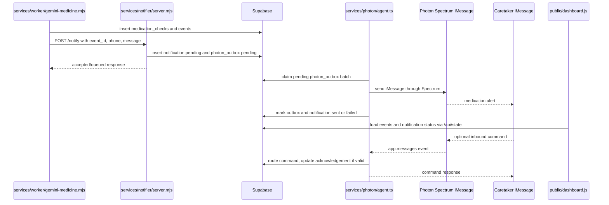
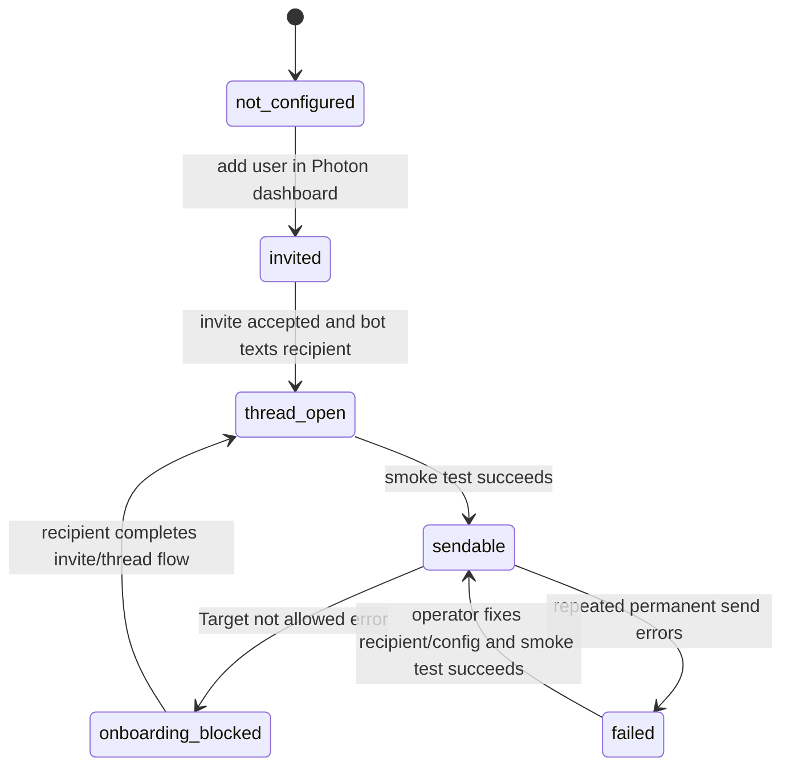
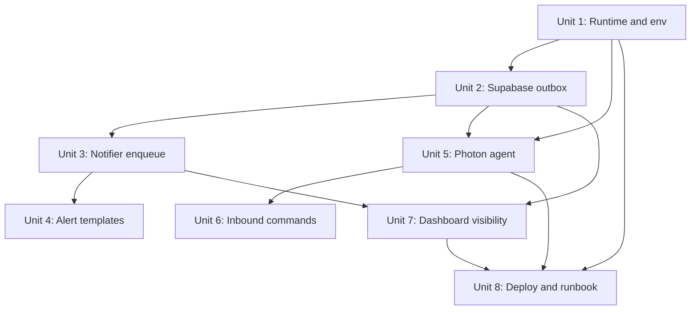

# Photon iMessage Alerts Integration

## Overview

This plan turns the current Photon notifier into a production-shaped alerting path for the caretaker app. The target behavior is: when the medicine vision worker determines that a patient missed medication, took only part of the expected medication, or the result is uncertain, the system records the event in Supabase, queues a durable Photon iMessage alert, and a long-lived Bun/Spectrum agent sends it to the caretaker once the Photon shared-cloud recipient thread is open.

The implementation should reuse the architecture and lessons from `docs/plans/PHOTON_INTEGRATION.md` while adapting them to this repository's current shape:

- The app is a plain Node ESM service in `server.mjs` and `src/app.mjs`, not Next.js.
- The background vision and checkout work already runs in `services/worker/index.mjs`.
- The current notifier exists at `services/notifier/server.mjs` and `services/notifier/photon-client.mjs`.
- Dashboard state already surfaces events and notifications through `src/supabase-store.mjs`.
- Deployment already runs separate web and worker EC2 processes through `ecosystem.web.config.cjs`, `ecosystem.workers.config.cjs`, and `scripts/deploy-workers.sh`.

The main architectural change is that no medicine worker, API handler, or notifier HTTP request should directly send to Photon. They should enqueue alert work in Supabase. A dedicated Photon agent process owns the Spectrum/iMessage connection, drains the outbox, updates delivery state, and optionally handles inbound caretaker commands.

## Problem Frame

The product idea in `docs/product_idea.md` depends on timely caretaker alerts. The medicine camera flow produces a Gemini judgment about medication adherence. If the patient did not take the right medicine at the right time, the caretaker needs a message they will actually see, not only an in-dashboard event.

The current implementation is close but not safe enough:

- `services/worker/gemini-medicine.mjs` calls a local notifier endpoint when adherence is not good.
- `services/notifier/server.mjs` validates a phone number and calls `sendIMessage`.
- `services/notifier/photon-client.mjs` tries multiple undocumented HTTP path variants against `PHOTON_SERVER_URL`, then marks the notification sent or failed immediately.
- `tests/notifier.test.mjs` only proves the stub behavior when Photon credentials are missing.

The Photon roadmap in `docs/plans/PHOTON_INTEGRATION.md` shows the more reliable shape: write alerts into an `outbox` table, let a long-lived Bun/Spectrum worker drain the queue, and handle inbound messages through the same agent process.

The teammate's key learning must become a first-class product and ops constraint: in Photon shared cloud mode, adding a user in the dashboard and seeing "Running" does not by itself mean arbitrary cold outbound messages will work. The recipient must accept the Photon invite email and receive the first message from the shared Photon bot number before our app can send alerts to that thread.

## Requirements Trace

- R1. Use the existing Photon roadmap in `docs/plans/PHOTON_INTEGRATION.md` as the primary technical reference, but adapt paths and service names to this repository.
- R2. Support the healthcare use case from `docs/product_idea.md`: iMessage alerts are for caretaker-facing medication events produced by the medicine camera and Gemini worker.
- R3. Preserve the shared-cloud onboarding truth: no cold messages in the shared Photon plan; the recipient must accept the invite and let the Photon bot open the iMessage thread first.
- R4. Keep the existing worker-to-notifier contract stable enough that `services/worker/gemini-medicine.mjs` can continue posting to `PHOTON_NOTIFY_URL`, while changing the notifier's behavior from direct send to durable enqueue.
- R5. Add a Supabase-backed outbox and delivery lifecycle so alerts are not lost when Photon is down, the worker restarts, or the notifier process crashes.
- R6. Use a dedicated Bun/Spectrum Photon agent process for real iMessage I/O because Spectrum exposes long-lived message streams and the prior project found `bun` to be the working runtime for the Photon package stack.
- R7. Keep dashboard state useful: queued, sent, failed, and blocked alert statuses should appear through existing `events` and `notifications` state.
- R8. Handle exact E.164 phone numbers consistently. Recipient authorization for inbound commands must use normalized caretaker phone values.
- R9. Do not copy live-looking credentials or real phone numbers from `docs/plans/PHOTON_INTEGRATION.md` into code, examples, tests, or this plan's implementation artifacts.
- R10. Add tests around queueing, schema shape, alert policy, command routing, config validation, and retry/error classification. Live Photon delivery remains smoke-tested, not part of automated unit tests.
- R11. Deployment must account for Bun on the worker host and add the Photon agent to PM2 without destabilizing the existing worker and notifier processes.
- R12. Leave room for future inbound commands that let caretakers acknowledge medication alerts and inspect status from iMessage.

## Scope Boundaries

- This plan does not implement code. It defines sequencing, files, decisions, tests, rollout, and operational checks.
- This plan does not attempt to bypass Photon shared-mode anti-spam restrictions or make cold outbound iMessages work.
- This plan does not require a macOS EC2 instance for the MVP. The current roadmap and official Photon Spectrum docs support a cloud/Spectrum path that can run as a long-lived worker process. A dedicated macOS or dedicated Apple ID path is a future alternative only if shared cloud is insufficient.
- This plan does not move grocery ordering or Knot checkout into Photon. Photon is the alerting and optional command surface; Knot remains the shopping/checkout integration.
- This plan does not send every successful medication confirmation immediately by default. For MVP, immediate iMessage alerts should be reserved for warning and critical states. Successful medication events should remain visible in the dashboard, with optional summary messages later if the user wants them.
- This plan does not make live Photon sends part of `npm test`. Automated tests should mock Photon/Spectrum and verify local behavior. A smoke script should verify real delivery manually after recipient onboarding is complete.
- This plan does not introduce full user authentication. It relies on the current demo data model plus service-role workers, matching the repository's hackathon scope.

### Deferred to Separate Tasks

- Dedicated Photon sender identity: If the shared bot number is not acceptable for the demo or product story, evaluate a dedicated Photon plan separately.
- Rich image attachments: MVP alerts should be text-first with event context. Snapshot attachments can follow once the agent confirms whether Spectrum should send a Buffer, a local file path, or a downloaded S3 object.
- Full two-way workflow for grocery approvals over iMessage: The command router should be designed to allow it, but the first implementation should focus on medication status, help, and acknowledgement.
- Production privacy and compliance hardening: Message minimization, PHI review, data retention, and stronger auth should be handled before a real healthcare deployment.

## Context & Research

### Relevant Code and Patterns

- `docs/plans/PHOTON_INTEGRATION.md`: prior complete Photon/Spectrum reference, including shared-cloud invite flow, outbox pattern, Bun runtime lesson, worker shape, and command router concept.
- `docs/product_idea.md`: product intent for patient, caretaker, pantry camera, medicine camera, Gemini workers, Knot shopping, and Photon iMessage alerts.
- `services/worker/gemini-medicine.mjs`: existing medicine analysis and alert trigger. It already posts `{ caretaker_phone, message, event_id }` to `PHOTON_NOTIFY_URL`.
- `services/notifier/server.mjs`: current local HTTP notifier service. It validates phone numbers, calls `sendIMessage`, and inserts a `notifications` row.
- `services/notifier/photon-client.mjs`: current direct HTTP Photon client. This should become deprecated or compatibility-only once the Spectrum agent is added.
- `supabase/migrations/001_initial_schema.sql`: existing `caretakers`, `events`, and `notifications` tables.
- `src/supabase-store.mjs`: dashboard state aggregator. It already reads notifications related to recent events.
- `ecosystem.workers.config.cjs`: PM2 currently runs `caretaker-worker` and `caretaker-notifier`; this is where the Photon agent process belongs.
- `scripts/deploy-workers.sh`: worker deploy flow currently installs Node dependencies and restarts PM2. It must gain Bun setup/verification before starting the Photon agent.
- `tests/notifier.test.mjs`, `tests/schema.test.mjs`, `tests/gemini-medicine.test.mjs`, `tests/worker-orchestration.test.mjs`: existing test entry points to extend.

### Institutional Learnings

- Photon shared cloud cannot reliably cold-message arbitrary recipients. The reliable flow is: add the recipient in Photon dashboard, recipient accepts invite email, Photon bot sends the first text, conversation thread is open, then our app can send.
- Dashboard status alone is not enough. "Running" can be misleading if the user has not accepted the invite and received the bot's first text.
- The prior project found `npx tsx` unsuitable for the Photon iMessage package stack and used `bun` for Photon scripts and the agent worker.
- The long-lived message stream shape means Photon I/O belongs in a persistent worker, not inside short-lived HTTP handlers.
- Exact phone formatting matters. Inbound soft-auth should compare normalized E.164 values.
- `docs/plans/PHOTON_INTEGRATION.md` includes live-looking secrets and phone numbers. Implementation should sanitize that document or at minimum ensure those values are rotated and never copied elsewhere.

### External References

- Photon Spectrum getting started: `https://docs.photon.codes/spectrum-ts/getting-started`
- Photon Spectrum messages: `https://docs.photon.codes/spectrum-ts/messages`
- Photon Spectrum content and attachments: `https://docs.photon.codes/spectrum-ts/content`
- Photon advanced iMessage getting started: `https://docs.photon.codes/advanced-kits/imessage/getting-started`
- Photon advanced iMessage messages: `https://docs.photon.codes/advanced-kits/imessage/messages`
- Photon open source iMessage kit: `https://github.com/photon-hq/imessage-kit`

External findings that matter for this plan:

- Spectrum is the higher-level multi-platform TypeScript SDK. It exposes `app.messages` as a long-lived async iterable of conversation context plus message content.
- Spectrum content supports plain text plus attachments from file paths or Buffers, which matters because this repo currently stores snapshot images by URL.
- Advanced iMessage docs expose lower-level send, subscribe, catch-up, and idempotency-style options. Those are useful as a fallback reference if Spectrum lacks a needed delivery control.
- Photon docs explicitly describe per-server and per-line quotas for the lower-level iMessage SDK. The plan should treat iMessage sends as rate-limited external I/O.
- Photon's advanced SDK docs mention Node.js 18+ or Bun, but the prior working roadmap found Bun to be the reliable runtime for this package stack in practice. Use Bun for the Photon agent and smoke scripts without migrating the rest of the app runtime.

## Key Technical Decisions

- Use the outbox pattern as the durable boundary: `services/worker/gemini-medicine.mjs` and `services/notifier/server.mjs` should enqueue alerts, not send to Photon directly. This prevents lost alerts and keeps Photon-specific failures out of the medicine analysis loop.
- Keep `/notify` as the internal API entry point: the worker already calls `PHOTON_NOTIFY_URL`. Reusing that path minimizes blast radius while changing its internals to create pending notification/outbox rows.
- Add a dedicated `photon-agent` PM2 process: the agent owns Spectrum app creation, outbox draining, delivery status updates, and inbound messages. This matches the official Spectrum message-stream model and the prior implementation.
- Use Bun only for the Photon agent and smoke script: the main app and existing workers stay Node ESM. This avoids a broad runtime migration while honoring the known Photon package constraint.
- Canonicalize Photon env names around Spectrum: use `PHOTON_PROJECT_ID` and `PHOTON_PROJECT_SECRET` as the preferred names. Keep `PHOTON_SECRET_KEY` as a temporary compatibility alias because this repo already uses it.
- Treat recipient readiness as application state: caretaker rows, or a small related recipient table, should record invite/thread readiness and last Photon error. This makes "Target not allowed for this project" actionable in the dashboard.
- Make notification status reflect real delivery state: insert `pending` when queued, update to `sent` only after the Photon agent sends successfully, and update to `failed` or `blocked` when the agent classifies an error.
- Use a database-side claim function for outbox rows: Supabase/PostgREST update loops are easy to make non-atomic. A SQL function using row locking is the safer way to claim pending rows when PM2 restarts or future multiple agents exist.
- Keep MVP alert content text-first: include patient name, medication event title, severity, time, and short action guidance. Include a dashboard link or event id when available. Attach snapshot images later after validating Photon attachment handling with S3-hosted images.
- Add inbound commands as pure command routing first: implement deterministic commands such as `help`, `status`, and `ack <event_id>` with tests. Avoid LLM command parsing and avoid free-form medical advice.

## Open Questions

### Resolved During Planning

- Does the app need macOS EC2 for MVP? No. The product idea assumed macOS, but the existing Photon roadmap and official Spectrum docs support a cloud/Spectrum worker path. Keep macOS only as a fallback for a future local/dedicated iMessage setup.
- Does the patient need a sender phone number? No for the shared cloud path. The sender identity is Photon's shared iMessage bot/Apple ID, not the patient.
- Should medicine successes send immediate iMessages? Not for the MVP alerting path. Send immediate alerts for warning/critical/uncertain outcomes; leave successful events in the dashboard and consider summaries later.
- Should the existing notifier service be deleted? No. Reuse it as the internal enqueue endpoint so the medicine worker integration stays stable.

### Deferred to Implementation

- Exact package versions: install the current compatible `spectrum-ts`, `@photon-ai/advanced-imessage`, and TypeScript versions during implementation and lock them in `package-lock.json`.
- Exact Spectrum send API shape in this repo: validate whether the agent should use the high-level Spectrum provider only or drop to the advanced iMessage SDK for idempotency/client message ids.
- Recipient dashboard automation: confirm whether Photon exposes a user management API for invite/readiness, or whether dashboard user creation remains manual for the hackathon demo.
- Attachment strategy: decide after a smoke test whether to send snapshot images as Buffers, temporary local files, or text links.
- Error taxonomy: classify actual Photon errors observed during smoke tests into retryable, permanent, and onboarding-required categories.

## Output Structure

The expected new and changed structure is:

```text
services/
  photon/
    agent.ts
    command-router.mjs
    config.mjs
    message-templates.mjs
    outbox.mjs
    sender.ts
    spectrum-app.ts
scripts/
  smoke-photon.ts
supabase/
  migrations/
    004_photon_alert_outbox.sql
tests/
  photon-command-router.test.mjs
  photon-config.test.mjs
  photon-outbox.test.mjs
```

The implementing agent may adjust exact filenames if the codebase fit is better, but the boundaries should remain: pure JS modules for testable app logic, Bun/TypeScript modules for live Spectrum integration, and SQL migration for durable queue behavior.

## High-Level Technical Design

This is directional guidance, not implementation specification. The exact module names and helper APIs can change during implementation as long as the boundaries hold.



The recipient state machine should be explicit:



## Implementation Units

- [ ] **Unit 1: Photon Runtime, Env, and Secret Hygiene**

**Goal:** Add the package/runtime foundation for a Bun/Spectrum agent without disturbing the existing Node app and worker.

**Requirements:** R3, R6, R8, R9, R11

**Dependencies:** None

**Files:**
- Modify: `package.json`
- Modify: `package-lock.json`
- Modify: `.env.example`
- Modify: `apps/workers.env.example`
- Modify: `ecosystem.workers.config.cjs`
- Modify: `scripts/deploy-workers.sh`
- Create: `services/photon/config.mjs`
- Test: `tests/photon-config.test.mjs`
- Review/sanitize: `docs/plans/PHOTON_INTEGRATION.md`

**Approach:**
- Add Photon dependencies and TypeScript support for the isolated Bun agent. The rest of the repo stays Node ESM.
- Add a package script for the Photon agent and a package script for the live smoke test. Do not make these part of the normal test command.
- Add canonical env vars:
  - `PHOTON_PROJECT_ID`
  - `PHOTON_PROJECT_SECRET`
  - `CARETAKER_PHONE` only for smoke/demo fallback, while normal sends should use the caretaker row phone.
  - `PHOTON_NOTIFY_URL`
  - `PHOTON_HTTP_PORT`
  - `PHOTON_AGENT_POLL_MS`
  - `PHOTON_AGENT_BATCH_SIZE`
  - `NOTIFIER_BIND_HOST`
  - Optional compatibility alias: `PHOTON_SECRET_KEY`
- Mark `PHOTON_SERVER_URL` as deprecated for the new path. It only belongs to the current undocumented direct HTTP sender.
- `services/photon/config.mjs` should normalize phones, validate required env only when live Photon is enabled, and expose a compatibility mapping from `PHOTON_SECRET_KEY` to `PHOTON_PROJECT_SECRET` during migration.
- Update worker deploy script so the target host can run Bun before PM2 starts the agent.
- Sanitize or at least flag the live-looking credentials in `docs/plans/PHOTON_INTEGRATION.md`. If those values were real, rotate them before live testing.

**Patterns to follow:**
- Current env examples in `.env.example` and `apps/workers.env.example`.
- PM2 process structure in `ecosystem.workers.config.cjs`.
- Deployment normalization pattern in `scripts/deploy-workers.sh`.

**Test scenarios:**
- Happy path: `services/photon/config.mjs` accepts `PHOTON_PROJECT_ID`, `PHOTON_PROJECT_SECRET`, and an E.164 caretaker phone and returns normalized values.
- Compatibility: when `PHOTON_PROJECT_SECRET` is missing but `PHOTON_SECRET_KEY` is present, config resolves the project secret and marks the alias as deprecated.
- Edge case: phone values with spaces or hyphens normalize to E.164.
- Error path: a phone without a leading country code is rejected with an actionable message.
- Error path: live Photon config validation fails clearly when credentials are missing.
- Security path: no tests or examples assert against real secrets or real phone numbers.

**Verification:**
- Env examples document the new variables without secrets.
- PM2 config includes a `caretaker-photon-agent` process that uses Bun.
- Node test suite can still run without live Photon credentials.

- [ ] **Unit 2: Supabase Outbox, Recipient Readiness, and Notification Lifecycle**

**Goal:** Add durable database state for queued Photon alerts, recipient readiness, send attempts, and dashboard-visible notification status.

**Requirements:** R3, R5, R7, R8, R10

**Dependencies:** Unit 1 config names should be settled before migration docs are finalized.

**Files:**
- Create: `supabase/migrations/004_photon_alert_outbox.sql`
- Modify: `supabase/seed.sql`
- Modify: `tests/schema.test.mjs`
- Test: `tests/photon-outbox.test.mjs`

**Approach:**
- Add a `photon_outbox` table linked to `events` and `notifications`. The row should store recipient phone, message body, optional snapshot reference, status, attempts, error code/message, next attempt time, and timestamps.
- Add a claim function for the agent to atomically claim pending rows. Prefer a SQL function that uses row locks and returns claimed rows over a client-side select-then-update loop.
- Add an attempt/audit trail either as separate `photon_outbox_attempts` rows or enough fields on the outbox row to debug failures. Choose the lighter option unless implementation reveals retry diagnostics need history.
- Extend `notifications` so `pending`, `sent`, and `failed` map accurately to outbox status. If `sent_at` is currently not-null/default-now, adjust it so pending notifications are not falsely marked sent.
- Add recipient readiness state. The simplest MVP path is columns on `caretakers`: email, `photon_status`, `photon_thread_opened_at`, `photon_last_error`, and `photon_last_smoke_test_at`. If implementation finds multiple recipients per caretaker are needed, use a separate `photon_recipients` table instead.
- Add optional event acknowledgement fields, or a related acknowledgement table, if the inbound `ack <event_id>` command is included in the first implementation.

**Patterns to follow:**
- Existing migration style in `supabase/migrations/001_initial_schema.sql` and `supabase/migrations/003_knot_tables.sql`.
- Existing notification relation through `event_id`.
- Existing permissive demo RLS policy style, while noting this must be tightened for production.

**Test scenarios:**
- Schema: migration defines `photon_outbox`, a pending index, and the database claim function.
- Schema: notification delivery statuses include at least `pending`, `sent`, and `failed`; if `blocked` is added for onboarding errors, assert it is allowed.
- Happy path: inserting a notification/outbox pair for an event produces a pending notification visible by event id.
- Edge case: duplicate enqueue for the same `event_id` and channel is idempotent or produces a documented second row only when explicitly requested.
- Error path: outbox rows cannot be inserted without a recipient phone or message body.
- Integration: claimed rows transition from `pending` to `sending` in one database operation and are not claimed twice.

**Verification:**
- Dashboard state can represent queued alerts without pretending they were sent.
- The migration is safe to apply after existing `001`, `002`, and `003` migrations.

- [ ] **Unit 3: Convert Notifier HTTP Service into a Durable Enqueue Boundary**

**Goal:** Keep the existing `/notify` integration point, but make it enqueue alerts and return a queued result instead of attempting direct Photon delivery.

**Requirements:** R4, R5, R7, R8, R10

**Dependencies:** Unit 2 outbox schema

**Files:**
- Modify: `services/notifier/server.mjs`
- Modify: `services/notifier/photon-client.mjs`
- Create: `services/photon/outbox.mjs`
- Modify: `tests/notifier.test.mjs`
- Test: `tests/photon-outbox.test.mjs`

**Approach:**
- Move phone normalization and payload validation into shared helpers in `services/photon/outbox.mjs`.
- `/health` should remain unchanged.
- `/notify` should:
  - accept `caretaker_phone` or `to`;
  - require a non-empty message;
  - accept `event_id` when available;
  - create or reuse a pending `notifications` row;
  - create a pending `photon_outbox` row linked to that notification;
  - return a queued response containing stable ids for the event, notification, and outbox row.
- Keep direct `sendIMessage` only as a deprecated compatibility helper or remove it if no caller remains. If kept, tests must make clear it is not the production delivery path.
- Bind the notifier to localhost by default using `NOTIFIER_BIND_HOST=127.0.0.1`, since it is an internal service called by the worker on the same host.
- Consider a shared internal token only if the notifier must be reachable across hosts.

**Execution note:** Start with characterization tests for the current `/notify` payload contract before changing the send behavior.

**Patterns to follow:**
- `services/notifier/server.mjs` body parsing and health endpoint.
- `src/supabase-server.mjs` server-side Supabase client behavior.
- Existing `notifications` insert in `services/notifier/server.mjs`.

**Test scenarios:**
- Happy path: valid `caretaker_phone`, `message`, and `event_id` returns queued status and inserts pending notification/outbox records using a mocked Supabase client.
- Compatibility: payload using `to` instead of `caretaker_phone` still works.
- Edge case: phone with formatting characters normalizes before persistence.
- Error path: invalid phone returns 400 and creates no outbox row.
- Error path: missing message returns 400 and creates no outbox row.
- Error path: Supabase unavailable returns a clear 503 or 500 and does not claim delivery success.
- Idempotency: posting the same `event_id` twice does not create duplicate active alerts unless explicitly allowed.

**Verification:**
- Medicine worker still only needs `PHOTON_NOTIFY_URL`.
- `/notify` response semantics make it clear that the alert is queued, not sent.
- The dashboard can show pending status immediately after enqueue.

- [ ] **Unit 4: Alert Policy and Medicine Message Templates**

**Goal:** Make medicine alerts useful, concise, and tied to patient context without spamming caretakers for normal events.

**Requirements:** R2, R4, R7, R10

**Dependencies:** Unit 3 enqueue boundary

**Files:**
- Modify: `services/worker/gemini-medicine.mjs`
- Create: `services/photon/message-templates.mjs`
- Modify: `tests/gemini-medicine.test.mjs`
- Test: `tests/notifier.test.mjs`

**Approach:**
- Create a pure message-template module that builds text from event severity, patient name, adherence status, due prescriptions, confidence, and event id.
- Immediate iMessage policy:
  - `missed`: send critical alert.
  - `partial`: send warning alert.
  - `uncertain`: send warning alert if prescriptions were due and the image cannot prove adherence.
  - `taken`: dashboard event only for MVP.
  - `outside_window`: no iMessage.
- Include a short action line such as "Reply ack <short-id> after you check in" once the command router exists.
- Avoid exposing unnecessary medical details in the message. Mention only enough to trigger caretaker action.
- Preserve the existing `events` row as the source of dashboard history.
- Ensure the worker does not block medicine snapshot processing on Photon enqueue failures longer than necessary; failures should be recorded as notification/outbox status.

**Patterns to follow:**
- Current severity/title/message branching in `services/worker/gemini-medicine.mjs`.
- Existing event creation before notification call.
- Existing tests in `tests/gemini-medicine.test.mjs`.

**Test scenarios:**
- Happy path: a missed medication result builds a critical message containing patient context and event id.
- Happy path: a partial medication result builds a warning message and enqueues exactly one alert.
- Edge case: uncertain result with no due prescriptions does not produce a noisy iMessage.
- Edge case: long Gemini reasoning is not included in the outbound message.
- Error path: notifier enqueue failure still leaves the event and medication check persisted.
- Regression: `taken` adherence does not enqueue an immediate iMessage under the MVP policy.

**Verification:**
- Alert messages are readable as actual caretaker texts.
- Medication processing behavior remains deterministic and testable without live Photon.

- [ ] **Unit 5: Bun/Spectrum Photon Agent for Outbound Delivery**

**Goal:** Implement the long-lived agent that creates the Spectrum app, drains queued alerts, sends iMessages, and updates Supabase state.

**Requirements:** R3, R5, R6, R7, R8, R10, R11

**Dependencies:** Units 1, 2, and 3

**Files:**
- Create: `services/photon/spectrum-app.ts`
- Create: `services/photon/sender.ts`
- Create: `services/photon/agent.ts`
- Create: `scripts/smoke-photon.ts`
- Modify: `package.json`
- Modify: `ecosystem.workers.config.cjs`
- Test: `tests/photon-outbox.test.mjs`

**Approach:**
- `spectrum-app.ts` should create and stop a Spectrum app using `PHOTON_PROJECT_ID`, `PHOTON_PROJECT_SECRET`, and the iMessage provider.
- `sender.ts` should send text to a normalized phone number through Spectrum. Keep any lower-level advanced SDK fallback isolated behind the same sender interface.
- `agent.ts` should:
  - start the Spectrum app once;
  - reclaim stale `sending` rows on boot after a conservative timeout;
  - poll the outbox at `PHOTON_AGENT_POLL_MS`;
  - claim a bounded batch using the database function;
  - send each message;
  - mark successful rows as sent and update the linked notification;
  - classify failures as retryable, permanent, or onboarding-blocked;
  - apply exponential or capped backoff for retryable failures;
  - shut down the Spectrum app on SIGTERM/SIGINT.
- `scripts/smoke-photon.ts` should send a single configured test message only when the operator explicitly runs it. It should check recipient readiness assumptions in its output.
- The agent should never log full message bodies by default. Log ids, statuses, and short error categories.

**Patterns to follow:**
- Worker loop lifecycle in `services/worker/index.mjs`.
- Timer helper style from `services/worker/queue.mjs`, if it fits.
- Agent worker concept from `docs/plans/PHOTON_INTEGRATION.md`.
- Official Spectrum app/message stream model from Photon docs.

**Test scenarios:**
- Happy path: mocked sender marks a claimed outbox row `sent` and updates the notification status to `sent`.
- Error path: mocked retryable Photon failure increments attempt count, records error, and schedules `next_attempt_at`.
- Error path: "Target not allowed" style error marks recipient or outbox as onboarding-blocked and updates dashboard-visible status.
- Edge case: a row stuck in `sending` beyond the stale threshold is returned to `pending`.
- Edge case: rows below `next_attempt_at` are not claimed.
- Edge case: agent shutdown calls the Spectrum stop hook.
- Integration smoke: with real Photon credentials and an already-open recipient thread, the smoke script sends a message and exits cleanly.

**Verification:**
- PM2 can run the agent alongside `caretaker-worker` and `caretaker-notifier`.
- Alerts are only marked sent after the agent succeeds.
- Shared-mode onboarding errors become visible and actionable.

- [ ] **Unit 6: Inbound Caretaker Command Router**

**Goal:** Add a small deterministic inbound command layer so caretakers can get status and acknowledge alerts from iMessage.

**Requirements:** R6, R8, R10, R12

**Dependencies:** Unit 5 agent and Unit 2 acknowledgement fields if acknowledgements are included

**Files:**
- Create: `services/photon/command-router.mjs`
- Modify: `services/photon/agent.ts`
- Test: `tests/photon-command-router.test.mjs`

**Approach:**
- Route only text messages.
- Ignore messages from senders whose normalized phone does not match a known caretaker phone.
- Implement MVP commands:
  - `help`: list supported commands.
  - `status`: return latest critical/warning medication events for the caretaker's patient.
  - `ack <event_id>` or `ack <short_id>`: mark the event acknowledged if the event belongs to the caretaker.
- Keep pantry/Knot commands such as `approve`, `block`, or `reorder` deferred unless the existing proposal approval flow is also wired through commands in this task.
- Store inbound command messages if useful for debugging, but avoid storing unnecessary free-form sensitive content.
- Use deterministic parsing. Do not call Gemini or another LLM to interpret caregiver commands.

**Patterns to follow:**
- Command router idea in `docs/plans/PHOTON_INTEGRATION.md`.
- Existing Supabase access pattern in worker services.
- Dashboard event model in `events`.

**Test scenarios:**
- Happy path: `help` returns deterministic command guidance.
- Happy path: `status` returns a concise summary when warning/critical events exist.
- Happy path: `ack <event_id>` updates the matching event acknowledgement state.
- Error path: unknown command returns the fallback help text.
- Error path: `ack` for another caretaker's event is rejected.
- Error path: messages from an unrecognized sender are ignored without side effects.
- Edge case: phone numbers are compared after normalization.

**Verification:**
- Caretaker can acknowledge an alert from iMessage and the dashboard reflects the acknowledgement after polling.
- The bot does not respond to random senders.

- [ ] **Unit 7: Dashboard and API Visibility for Alert Readiness and Delivery**

**Goal:** Make Photon readiness and delivery state visible in the existing dashboard so demo operators know whether alerts can be sent.

**Requirements:** R3, R7, R8, R10

**Dependencies:** Units 2 and 3

**Files:**
- Modify: `src/supabase-store.mjs`
- Modify: `src/app.mjs`
- Modify: `public/dashboard.js`
- Modify: `public/patient.js`
- Modify: `public/dashboard.html`
- Modify: `public/patient.html`
- Modify: `tests/app.test.mjs`

**Approach:**
- Extend `/api/state` to include caretaker Photon readiness and recent notification delivery state.
- Show the caretaker phone, Photon readiness, and last alert status in the dashboard profile summary.
- Add patient/settings UI fields for caretaker phone and email if the schema adds email for Photon invite tracking.
- Add clear operator-facing states:
  - not configured;
  - invite pending/manual setup required;
  - thread open/sendable;
  - onboarding blocked due to "Target not allowed";
  - failed due to repeated send errors.
- Do not include implementation instructions as in-app tutorial text. Keep copy brief and operational.
- If an alert is pending or failed, show it in the existing event/notification list instead of adding a separate page.

**Patterns to follow:**
- Existing state rendering in `public/dashboard.js`.
- Existing profile editing in `src/supabase-store.mjs` and `public/patient.js`.
- Existing notification mapping in `src/supabase-store.mjs`.

**Test scenarios:**
- Happy path: `/api/state` includes notification status and Photon readiness fields for the caretaker.
- Happy path: updating the caretaker phone/email persists and returns normalized values.
- Edge case: missing Photon readiness state renders as not configured, not as an error.
- Error path: invalid caretaker phone update is rejected before it can break the agent's soft-auth.
- Regression: existing dashboard state still includes cameras, inventory, prescriptions, proposals, events, and notifications.

**Verification:**
- A demo operator can look at the dashboard and know whether iMessage alerts are sendable.
- Notification state transitions are visible without checking PM2 logs.

- [ ] **Unit 8: Deployment, Smoke Test, and Runbook**

**Goal:** Make the Photon integration operable on the existing worker host and document the exact readiness checks needed for shared mode.

**Requirements:** R3, R6, R9, R10, R11

**Dependencies:** Units 1 through 7

**Files:**
- Modify: `README.md`
- Create or modify: `docs/SMOKE_TEST.md`
- Create: `docs/PHOTON_RUNBOOK.md`
- Modify: `scripts/deploy-workers.sh`
- Modify: `scripts/logs-workers.sh`
- Modify: `apps/workers.env.example`
- Modify: `ecosystem.workers.config.cjs`

**Approach:**
- Document the shared-mode onboarding checklist:
  - add user in Photon dashboard with name, phone, and email;
  - user accepts invite email;
  - user receives first Photon bot iMessage;
  - smoke script succeeds;
  - dashboard shows sendable/thread-open state.
- Document the correct runtime: Photon scripts use Bun, while the existing app and workers use Node.
- Add log guidance for `caretaker-photon-agent`.
- Add failure playbooks:
  - missing Bun;
  - missing Photon credentials;
  - target not allowed;
  - invalid phone;
  - repeated retryable Photon errors;
  - outbox stuck in sending.
- Include a reminder that `docs/plans/PHOTON_INTEGRATION.md` had sensitive examples and must not be used as an env source.

**Patterns to follow:**
- Current deployment docs in `README.md`.
- Current two-EC2 process shape in `ecosystem.workers.config.cjs`.
- Current smoke checklist reference in `README.md`.

**Test scenarios:**
- Test expectation: no unit tests for pure documentation changes beyond existing schema/config tests. Verification is operational.

**Verification:**
- A fresh worker host can run the existing worker, notifier, and Photon agent.
- The runbook explains why a dashboard-added user may still be unable to receive app alerts.
- Smoke test procedure proves a real alert can be sent only after recipient onboarding is complete.

## Unit Dependency Graph



## System-Wide Impact

- **Interaction graph:** Medicine worker -> notifier -> Supabase outbox -> Photon agent -> Photon/Spectrum -> caretaker iMessage -> optional inbound command -> Supabase -> dashboard.
- **Error propagation:** Gemini processing should not fail solely because Photon is unavailable. Alert enqueue failures should create dashboard-visible notification failures. Photon send failures should stay in outbox/notification state and agent logs.
- **State lifecycle risks:** The hardest state edge is duplicate sending after a crash between Photon send success and database update. The outbox claim function and cautious retries reduce this, but exact provider idempotency should be revisited during implementation.
- **API surface parity:** `/notify` remains the internal worker contract; `/api/state` becomes the dashboard read surface for readiness and delivery state.
- **Integration coverage:** Unit tests prove queueing and state transitions. Real Photon delivery needs a smoke script because it depends on external account state and the recipient's iMessage thread.
- **Unchanged invariants:** Existing pantry, Knot, camera pairing, and dashboard event flows should keep working. Photon changes should only alter how medication alerts are delivered and represented.

## Alternative Approaches Considered

| Approach | Why not chosen for MVP |
|---|---|
| Keep the current direct HTTP `PHOTON_SERVER_URL` sender | It relies on undocumented path guessing, cannot receive inbound messages, and marks delivery synchronously from an HTTP response instead of a durable lifecycle. |
| Send directly from `services/worker/gemini-medicine.mjs` | This couples Gemini processing to external messaging availability and makes retries/crash recovery harder. |
| Run Photon inside the web server | Spectrum message streams are long-lived, and the web server should not own external messaging loops. |
| Provision macOS EC2 immediately | The existing Photon roadmap and official Spectrum docs support cloud/Spectrum first. macOS adds cost and setup risk without solving the shared-mode invite constraint. |
| Use LLM parsing for inbound commands | Deterministic command parsing is faster, cheaper, safer, and easier to test for a healthcare-adjacent alert channel. |

## Success Metrics

- A missed or partial medication event creates exactly one pending notification and one pending Photon outbox row.
- The Photon agent sends the alert after the recipient thread is open and marks the notification sent.
- "Target not allowed" or equivalent onboarding errors are visible in dashboard state and do not loop forever as generic failures.
- A caretaker can reply `status` and receive a concise recent-event summary.
- A caretaker can reply `ack <event_id>` and the event becomes acknowledged in the dashboard.
- Existing pantry/Knot checkout flows continue to pass their tests.
- Worker deployment starts three PM2 processes on the worker host: worker, notifier, and Photon agent.

## Dependencies / Prerequisites

- Photon dashboard project with `PHOTON_PROJECT_ID` and project secret.
- iMessage provider enabled for the Photon project.
- Recipient added in Photon dashboard with name, E.164 phone, and email.
- Recipient invite accepted and first Photon bot message received.
- Bun installed on the worker host.
- Supabase service role env available to notifier and Photon agent.
- Supabase migrations applied through `004_photon_alert_outbox.sql`.

## Risk Analysis & Mitigation

| Risk | Likelihood | Impact | Mitigation |
|---|---:|---:|---|
| Shared-mode recipient cannot receive cold messages | High | High | Track recipient readiness, document invite flow, classify "Target not allowed" as onboarding-blocked, and run smoke test before demo. |
| Bun missing on worker host | Medium | High | Update deploy script and PM2 config; add runbook checks before starting agent. |
| Duplicate alerts after crash during send/update gap | Medium | Medium | Use database claim function, outbox ids, cautious retry policy, and provider idempotency if available. |
| Direct HTTP Photon client remains accidentally used | Medium | Medium | Deprecate or isolate `services/notifier/photon-client.mjs`; tests should assert `/notify` queues rather than sends. |
| PII/PHI leakage in logs or messages | Medium | High | Keep messages minimal, avoid full body logs, avoid Gemini reasoning in texts, and avoid storing unnecessary inbound content. |
| Phone formatting mismatch breaks inbound auth | Medium | Medium | Normalize all phones at boundaries and test exact comparison behavior. |
| Dashboard says sent when alert is only queued | Medium | Medium | Make `notifications.sent_at` lifecycle accurate and map from outbox status. |
| Photon package API changes | Medium | Medium | Keep live SDK usage isolated in `services/photon/spectrum-app.ts` and `services/photon/sender.ts`; rely on tests around local boundaries and smoke test live calls. |
| Secrets copied from the old roadmap | Medium | High | Sanitize `docs/plans/PHOTON_INTEGRATION.md`, rotate if needed, and use placeholders only in docs and env examples. |

## Phased Delivery

### Phase 0: Safety and Runtime Groundwork

- Complete Unit 1.
- Confirm no real Photon credentials are copied into tracked docs or examples.
- Establish Bun availability on the worker host.

### Phase 1: Durable Queue Without Live Photon

- Complete Units 2, 3, and 4.
- At the end of this phase, medicine alerts should queue and show pending/failed state without requiring live Photon delivery.

### Phase 2: Live Outbound Photon Delivery

- Complete Unit 5.
- Run smoke delivery only after recipient invite acceptance and initial bot message.
- Confirm dashboard state transitions from pending to sent.

### Phase 3: Two-Way Caretaker Utility

- Complete Unit 6.
- Complete Unit 7.
- Confirm caretaker can ask status and acknowledge alerts through iMessage.

### Phase 4: Deployment and Demo Hardening

- Complete Unit 8.
- Validate worker host PM2 processes, logs, and runbook.
- Run end-to-end demo: medicine snapshot -> Gemini event -> notification pending -> Photon send -> dashboard sent -> inbound acknowledgement.

## Documentation / Operational Notes

- `README.md` should describe three worker-side processes once the agent exists.
- `docs/PHOTON_RUNBOOK.md` should be the operator reference for dashboard setup, recipient invite status, smoke testing, and common errors.
- `docs/SMOKE_TEST.md` should include a Photon-specific checklist but avoid real phone numbers and secrets.
- `apps/workers.env.example` should be the deployment env source of truth, with placeholders only.
- The runbook should explicitly state that the shared Photon bot number is a shared-mode implementation detail and may differ by project or plan; operators should verify from the actual first message received.

## Sources & References

- Origin roadmap: `docs/plans/PHOTON_INTEGRATION.md`
- Product context: `docs/product_idea.md`
- Current medicine worker: `services/worker/gemini-medicine.mjs`
- Current notifier: `services/notifier/server.mjs`
- Current Photon client: `services/notifier/photon-client.mjs`
- Current schema: `supabase/migrations/001_initial_schema.sql`
- Current worker deployment: `ecosystem.workers.config.cjs`, `scripts/deploy-workers.sh`
- Photon Spectrum getting started: `https://docs.photon.codes/spectrum-ts/getting-started`
- Photon Spectrum messages: `https://docs.photon.codes/spectrum-ts/messages`
- Photon Spectrum content: `https://docs.photon.codes/spectrum-ts/content`
- Photon advanced iMessage getting started: `https://docs.photon.codes/advanced-kits/imessage/getting-started`
- Photon advanced iMessage messages: `https://docs.photon.codes/advanced-kits/imessage/messages`
- Photon iMessage kit repository: `https://github.com/photon-hq/imessage-kit`
